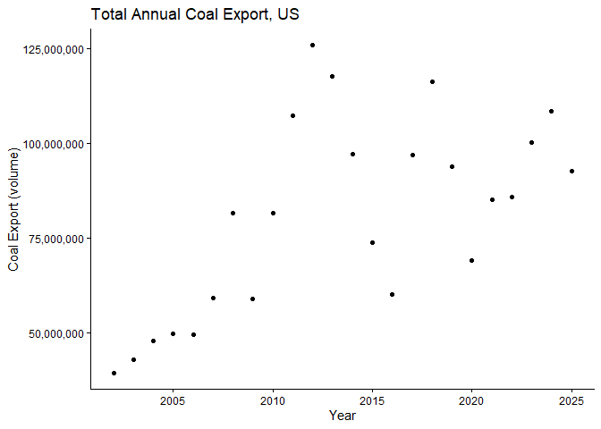
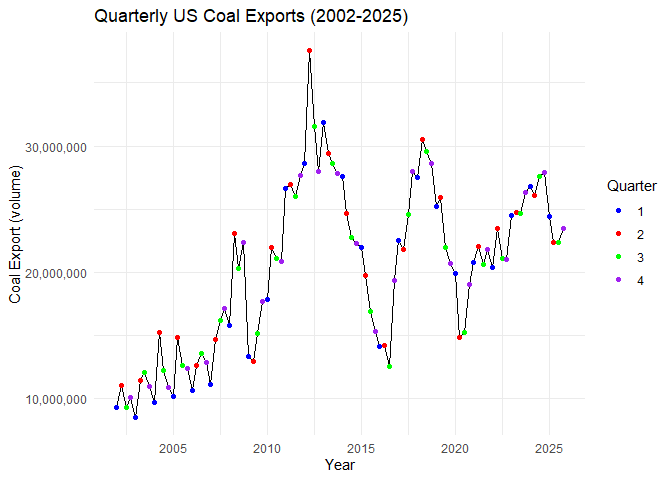
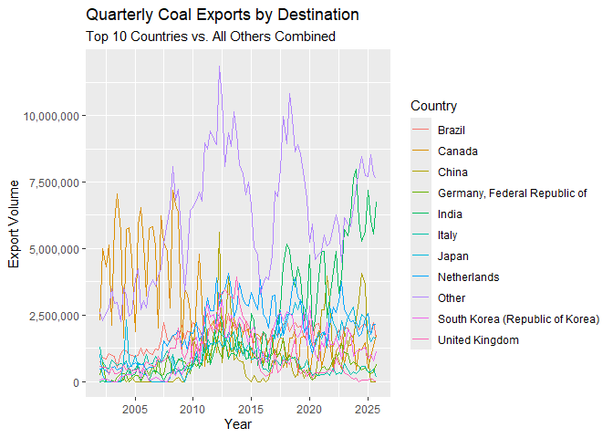
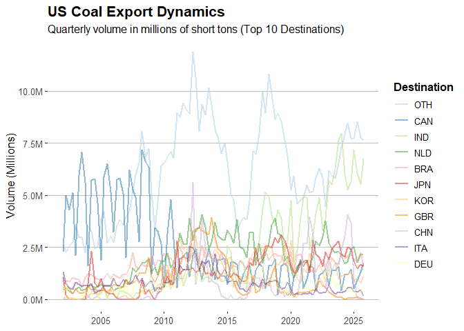
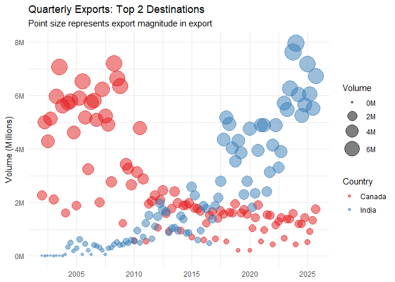

## Goal and requirements

The goal of this assignment is to impress with your data wrangling skills. 

Some additional points:  

- You can create a new GitHub repo for this assignment.  
- Name your GitHub repo something like `aec699-hw2-datawrangling-lastname`.  
- Make sure to organize your data into a `data/` folder and your code into a `scripts/` or `code/` folder.  
- Do not forget to knit the assignment (click the “Knit” button, or press `Ctrl+Shift+K`) before submitting.  
- **Please put your (written) answers in bold.**  

### What you will be graded on

- Is the code correct?  
- Are the outcomes correct?  
- Did you show your work?  
- Are the figures clear?  
- Did you follow the instructions of the assignment?  

## Preliminaries: 

### Load libraries

It is a good idea to load your libraries at the top of the Rmd document so that everyone can see what you are using. Similarly, it is good practice to set this type of chunk with `cache=FALSE` to ensure that the libraries are dynamically loaded each time you knit the document.

*Hint: I have only added the libraries needed to download and read the data. You will need to load additional libraries to complete this assignment. Add them here once you discover that you need them.* 


``` r
if (!require("pacman")) install.packages("pacman")  # install the pacman package if necessary
pacman::p_load(httr,readxl,here)  # install other packages using pacman::p_load()

library(tidyverse)
library(knitr)
library(janitor)
library(ggthemes)
library(countrycode)
library(scales)
library(plotly)
```

### Read in the data

Use `httr::GET()` to fetch the EIA excel file for us from web.


``` r
# library(here)  # already loaded
# library(httr)  # already loaded
url <- "https://www.eia.gov/coal/archive/coal_historical_exports.xlsx"
if(!file.exists(here::here("data/coal.xlsx"))) {  # only download the file if we need to
  GET(url, write_disk(here::here("data/coal.xlsx")))  # modify relative path to match directory
}
```

Next, we read in the file.


``` r
# library(readxl) already loaded
coal <- read_xlsx(here::here("data/coal.xlsx"), skip=3, na=".")
```

We are now ready to go.

## 1) Clean the column names

The column (i.e. variable) names are not great: Spacing, uppercase letters, etc. Clean them. 

*Hint: You can use `gsub()` and regular expressions, or external packages like `magrittr` or `janitor`.*


``` r
coal <- clean_names(coal)
```

**Column headings fixed.***

## 2) Total US coal exports over time (year only)

Plot the US's total coal exports over time by year ONLY. What secular trends do you notice in the data?

*Hints: If you want nicely formatted y-axis label, add `+ scale_y_continuous(labels = scales::comma)` to your `ggplot2` code.*


``` r
annual_coal <- coal %>%
  group_by(year) %>%
  summarize(
    across(
      c(steam_coal, steam_revenue,
              metallurgical, metallurgical_revenue,
              total, total_revenue,
              coke, coke_revenue),
            ~ sum(.x, na.rm = TRUE)
    )
  )

ggplot(data = annual_coal, mapping = aes(x = year, y = total)) +
    geom_point() +
    labs(title = "Total Annual Coal Export, US", x = "Year", y = "Coal Export (volume)") +
    scale_y_continuous(labels = scales::comma) +
    theme_classic()
```

<!-- -->
**An overall increasing trend, but noisy after ~2008. For example, the period 2012-2016 saw decline every year.**

## 3) Total US coal exports over time (year AND quarter)

Now do the same as the above, except aggregated quarter of year (2001Q1, 2002Q2, etc.). Do you notice any seasonality that was masked from the yearly totals?

*Hint: ggplot2 is going to want you to convert your quarterly data into actual date format before it plots nicely. (i.e. Don't leave it as a string.)*


``` r
quarterly_coal <- coal %>%
  group_by(year, quarter) %>%
  summarize(
    across(
      c(steam_coal, steam_revenue,
              metallurgical, metallurgical_revenue,
              total, total_revenue,
              coke, coke_revenue),
            ~ sum(.x, na.rm = TRUE)
    )
  ) %>%
  mutate(date = yq(paste(year, quarter, sep = "-")))

ggplot(quarterly_coal, aes(x = date, y = total)) +
    geom_line(color = "black") +
    geom_point(aes(color = as.factor(quarter))) +
    scale_color_manual(values = c("blue", "red", "green", "purple")) +
    scale_y_continuous(labels = scales::comma) +
    labs(title = "Quarterly US Coal Exports (2002-2025)",
         x = "Year",
         y = "Coal Export (volume)",
         color = "Quarter") +
    theme_minimal()
```

<!-- -->

**Some hint of seasonality in the early years, with low export during the first quarter and high exports during the second and third quarters. This pattern is less visually pronounced in the latter years.**

## 4) Exports by destination country

### 4.1) Create a new data frame

Create a new data frame called `coal_country` that aggregates total exports by destination country (and quarter of year). Make sure you print the resulting data frame so that it appears in the knitted R markdown document.


``` r
coal_country <- coal %>%
    group_by(coal_destination_country, year, quarter) %>%
    summarize(
        across(
            c(steam_coal, steam_revenue,
              metallurgical, metallurgical_revenue,
              total, total_revenue,
              coke, coke_revenue),
            ~ sum(.x, na.rm = TRUE)
        )
    ) %>%
  arrange(coal_destination_country, year, quarter)
coal_country
```

```
## # A tibble: 5,750 × 11
## # Groups:   coal_destination_country, year [1,906]
##    coal_destination_country  year quarter steam_coal steam_revenue metallurgical
##    <chr>                    <dbl>   <dbl>      <dbl>         <dbl>         <dbl>
##  1 Albania                   2016       4         74          7701             0
##  2 Albania                   2023       2      24152       2554925             0
##  3 Algeria                   2002       1       5952        150930        123353
##  4 Algeria                   2002       3          0             0         62931
##  5 Algeria                   2002       4          0             0        129563
##  6 Algeria                   2003       1          0             0        128525
##  7 Algeria                   2003       2          0             0         70539
##  8 Algeria                   2003       3          0             0        141813
##  9 Algeria                   2003       4          0             0         66499
## 10 Algeria                   2004       1          0             0        141438
## # ℹ 5,740 more rows
## # ℹ 5 more variables: metallurgical_revenue <dbl>, total <dbl>,
## #   total_revenue <dbl>, coke <dbl>, coke_revenue <dbl>
```

### 4.2) Inspect the data frame

It looks like some countries are missing data for a number of years and periods (e.g. Albania). Confirm that this is the case. What do you think is happening here?


``` r
coal_country %>%
    filter(
        coal_destination_country == "Albania"
        )
```

```
## # A tibble: 2 × 11
## # Groups:   coal_destination_country, year [2]
##   coal_destination_country  year quarter steam_coal steam_revenue metallurgical
##   <chr>                    <dbl>   <dbl>      <dbl>         <dbl>         <dbl>
## 1 Albania                   2016       4         74          7701             0
## 2 Albania                   2023       2      24152       2554925             0
## # ℹ 5 more variables: metallurgical_revenue <dbl>, total <dbl>,
## #   total_revenue <dbl>, coke <dbl>, coke_revenue <dbl>
```

``` r
coal_country %>%
  filter(is.na(coal_destination_country)
         )
```

```
## # A tibble: 0 × 11
## # Groups:   coal_destination_country, year [0]
## # ℹ 11 variables: coal_destination_country <chr>, year <dbl>, quarter <dbl>,
## #   steam_coal <dbl>, steam_revenue <dbl>, metallurgical <dbl>,
## #   metallurgical_revenue <dbl>, total <dbl>, total_revenue <dbl>, coke <dbl>,
## #   coke_revenue <dbl>
```

``` r
coal_country %>%
    group_by(year) %>%
    summarize(unique_countries = n_distinct(coal_destination_country))
```

```
## # A tibble: 24 × 2
##     year unique_countries
##    <dbl>            <int>
##  1  2002               62
##  2  2003               63
##  3  2004               71
##  4  2005               73
##  5  2006               73
##  6  2007               82
##  7  2008               92
##  8  2009               98
##  9  2010               99
## 10  2011               86
## # ℹ 14 more rows
```
**Only two rows for Albania appears in the dataset. This indicates that the coal export destinations are not uniform across all quarters/years.**

**In 2002, coal was exported to 62 countries (lowest in the sample period) while 2009 saw exports to a high 98 countries.**

### 4.3) Complete the data frame

Fill in the implicit missing values, so that each country has a representative row for every year-quarter time period. In other words, you should modify the data frame so that every destination country has row entries for all possible year-quarter combinations (from 2002Q1 through the most recent quarter). I.e., a balanced panel. Order your updated data frame by country, year and, quarter. 

*Hints: See `?tidyr::complete()` for some convenient options. Another option is `tidyr::crossing()`. Do not forget to print `coal_country` after you have updated the data frame to show the results.*


``` r
balanced_coal <- coal_country %>%
  ungroup() %>% 
  complete(
    coal_destination_country, 
    year, 
    quarter, 
    fill = list(
      steam_coal = 0, 
      steam_revenue = 0, 
      metallurgical = 0, 
      metallurgical_revenue = 0,
      total = 0,
      total_revenue = 0,
      coke = 0,
      coke_revenue = 0
    )
  )

balanced_coal %>%
    group_by(year, quarter) %>%
    summarize(unique_countries = n_distinct(coal_destination_country))
```

```
## # A tibble: 96 × 3
## # Groups:   year [24]
##     year quarter unique_countries
##    <dbl>   <dbl>            <int>
##  1  2002       1              152
##  2  2002       2              152
##  3  2002       3              152
##  4  2002       4              152
##  5  2003       1              152
##  6  2003       2              152
##  7  2003       3              152
##  8  2003       4              152
##  9  2004       1              152
## 10  2004       2              152
## # ℹ 86 more rows
```

**We have 152 countries in each quarter of the sample period.**

### 4.4 Some more tidying up

In answering the previous question, you _may_ encounter a situation where the data frame contains a quarter that is missing total export numbers for *all* countries. Did this happen to you? Filter out the completely missing quarter if so. Also: Why do you think this might have happened? (Please answer the latter question even if it did not happen to you.)


``` r
missing_quarters <- balanced_coal %>%
  group_by(year, quarter) %>%
  summarize(max_total = max(total), .groups = "drop") %>%
  filter(max_total == 0)
missing_quarters
```

```
## # A tibble: 0 × 3
## # ℹ 3 variables: year <dbl>, quarter <dbl>, max_total <dbl>
```
**No quarters show 0 coal export. If such rows existed, it would indicate that US did not export any coal to any country during those quarters.**

### 4.5) Culmulative top 10 US coal export destinations

Produce a vector -- call it `coal10_culm` -- of the top 10 top coal destinations over the full study period. What are they?


``` r
coal10_culm <- balanced_coal %>%
  group_by(coal_destination_country) %>%
  summarize(total_export = sum(total, na.rm = TRUE)) %>%
  arrange(desc(total_export)) %>%
  slice(1:10)
coal10_culm
```

```
## # A tibble: 10 × 2
##    coal_destination_country        total_export
##    <chr>                                  <dbl>
##  1 Canada                             240161835
##  2 India                              204844550
##  3 Netherlands                        191656543
##  4 Brazil                             162822268
##  5 Japan                              122462840
##  6 South Korea (Republic of Korea)    118580477
##  7 United Kingdom                      90233190
##  8 China                               79538737
##  9 Italy                               75730903
## 10 Germany, Federal Republic of        66816199
```
**The top 10 top coal destinations over the full study period displayed above.**

### 4.6) Recent top 10 US coal export destinations

Now do the same, except for the most recent period on record (i.e. final quarter in the dataset). Call this vector `coal10_recent` and make sure to print it so that it is visible too. Are there any interesting differences between the two vectors? Apart from any secular trends, what else might explain these differences?


``` r
coal10_recent <- balanced_coal %>%
    filter(year == 2025 & quarter == 4) %>%
    arrange(desc(total)) %>%
    slice(1:10)

coal10_recent %>%
  select(coal_destination_country, year, quarter, total)
```

```
## # A tibble: 10 × 4
##    coal_destination_country         year quarter   total
##    <chr>                           <dbl>   <dbl>   <dbl>
##  1 India                            2025       4 6744946
##  2 Netherlands                      2025       4 2154820
##  3 Canada                           2025       4 1742456
##  4 Brazil                           2025       4 1620166
##  5 Japan                            2025       4 1591396
##  6 Indonesia                        2025       4 1324510
##  7 Turkey                           2025       4 1149735
##  8 South Korea (Republic of Korea)  2025       4 1132432
##  9 Morocco                          2025       4  989493
## 10 Germany, Federal Republic of     2025       4  656054
```
**Top 10 coal export destinations from US for the fourth quarter of 2025 printed above. This is different from the cumulative top 10 list for the sample period. The differences between the two lists likely represent patterns in growth rates, geo-politics, as well as adoption rates of clean energy.**

### 4.7) US coal exports over time by country

Plot the quarterly coal exports over time, but now disaggregated by country. In particular, highlight the top 10 (cumulative) export destinations and then sum the remaining countries into a combined "Other" category. (In other words, your figure should contain the time series of eleven different countries/categories.)


``` r
top_10_names <- coal10_culm$coal_destination_country

plot_data <- balanced_coal %>%
  mutate(country_group = if_else(coal_destination_country %in% top_10_names, 
                                 coal_destination_country, 
                                 "Other")) %>%
  group_by(country_group, year, quarter) %>%
  summarize(total = sum(total, na.rm = TRUE), .groups = "drop") %>%
  mutate(date = lubridate::yq(paste(year, quarter, sep = "-")))


ggplot(plot_data, aes(x = date, y = total, group = country_group, color = country_group)) +
  geom_line() +
  scale_y_continuous(labels = scales::comma) +
  labs(
    title = "Quarterly Coal Exports by Destination",
    subtitle = "Top 10 Countries vs. All Others Combined",
    x = "Year",
    y = "Export Volume",
    color = "Country"
  )
```

<!-- -->

### 4.8) Make it pretty

Take your previous plot and add some style to it. That is, try to make it as visually appealing as possible without overloading it with chart junk.

*Hint: You have a lot of options here. If you have not already done so, consider a more bespoke theme with the `ggthemes` or `cowplot` packages. Try out `scale_fill_brewer()` and `scale_color_brewer()` for a range of interesting color palettes. Try transparency effects with `alpha`. Give your axis labels more refined names with the `labs()` layer in ggplot2. Or, you might want to scale (i.e. normalize) your y-variable to get rid of all those zeros. You can shorten any country names to their ISO abbreviation; see `?countrycode::countrycode`. More substantively, but more complicated, you might want to re-order your legend (and the plot itself) according to the relative importance of the destination countries. See `?forcats::fct_reorder` or `?forcats::fct_relevel`.*


``` r
plot_data_final <- plot_data %>%
  mutate(
    iso_label = if_else(country_group == "Other", "OTH", 
                        countrycode(country_group, "country.name", "iso3c")),
    iso_label = fct_reorder(iso_label, total, .fun = mean, .desc = TRUE)
  )
```

```
## Warning: There was 1 warning in `mutate()`.
## ℹ In argument: `iso_label = if_else(...)`.
## Caused by warning:
## ! Some values were not matched unambiguously: Other
## To fix unmatched values, please use the `custom_match` argument. If you think the default matching rules should be improved, please file an issue at https://github.com/vincentarelbundock/countrycode/issues
```

``` r
ggplot(plot_data_final, aes(x = date, y = total, color = iso_label, group = iso_label)) +
  geom_line(linewidth = 1, alpha = 0.5) +
  scale_color_brewer(palette = "Paired") +
  scale_y_continuous(labels = label_number(scale = 1e-6, suffix = "M")) +
  labs(
    title = "US Coal Export Dynamics",
    subtitle = "Quarterly volume in millions of short tons (Top 10 Destinations)",
    x = NULL, 
    y = "Volume (Millions)",
    color = "Destination"
  ) +
  theme_hc() + 
  theme(
    legend.position = "right",
    legend.title = element_text(face = "bold"),
    plot.title = element_text(face = "bold", size = 16),
    panel.grid.major.y = element_line(color = "grey")
  )
```

<!-- -->

### 4.9) Make it interactive

Create an interactive version of your previous figure.

*Hint: Take a look at plotly::ggplotly(), or the gganimate package.*


``` r
p <- ggplot(plot_data_final, aes(x = date, y = total, color = iso_label, group = iso_label)) +
  geom_line(linewidth = 0.8, alpha = 0.8) +
  scale_color_brewer(palette = "Paired") +
  scale_y_continuous(labels = scales::label_number(scale = 1e-6, suffix = "M")) +
  labs(
    title = "Interactive US Coal Export Trends",
    x = "Year", 
    y = "Volume (Millions)",
    color = "Country"
  ) +
  theme_minimal()

interactive_plot <- ggplotly(p, tooltip = c("x", "y", "color"))

interactive_plot
```

```{=html}
<div class="plotly html-widget html-fill-item" id="htmlwidget-e3d2adde5e7df5c61b13" style="width:672px;height:480px;"></div>
<script type="application/json" data-for="htmlwidget-e3d2adde5e7df5c61b13">{"x":{"data":[{"x":[11688,11778,11869,11961,12053,12143,12234,12326,12418,12509,12600,12692,12784,12874,12965,13057,13149,13239,13330,13422,13514,13604,13695,13787,13879,13970,14061,14153,14245,14335,14426,14518,14610,14700,14791,14883,14975,15065,15156,15248,15340,15431,15522,15614,15706,15796,15887,15979,16071,16161,16252,16344,16436,16526,16617,16709,16801,16892,16983,17075,17167,17257,17348,17440,17532,17622,17713,17805,17897,17987,18078,18170,18262,18353,18444,18536,18628,18718,18809,18901,18993,19083,19174,19266,19358,19448,19539,19631,19723,19814,19905,19997,20089,20179,20270,20362],"y":[2605613,2281543,2547928,2782358,3493542,2954375,2989086,2246098,3523302,3257503,2444688,2547130,3848670,4232638,2698351,3025093,2755084,3517520,3818560,3581078,3959339,4237519,5181112,5982337,6541411,8098958,6802644,7231848,5082914,3370365,4670053,6426029,6546235,6822694,7119812,6776257,8970662,8721661,9415306,9105154,8912578,11868353,10638394,8073125,9369520,8856736,10152367,9330517,8156974,7799717,7005637,7493893,6609576,5025128,4783561,3277099,3644540,3928890,3817023,4741988,7146885,6955569,7984510,9988396,8933446,10820361,9901947,8635427,8919752,8563866,7626146,6889998,5251700,5917860,4581601,4774773,4885323,5495765,5111722,5187267,5837279,6267919,5834000,4476109,6180497,5935608,5804453,6527040,7309665,7930362,8453705,7753121,7701529,8524164,7762085,7655829],"text":["date: 2002-01-01<br />total:  2605613<br />iso_label: OTH","date: 2002-04-01<br />total:  2281543<br />iso_label: OTH","date: 2002-07-01<br />total:  2547928<br />iso_label: OTH","date: 2002-10-01<br />total:  2782358<br />iso_label: OTH","date: 2003-01-01<br />total:  3493542<br />iso_label: OTH","date: 2003-04-01<br />total:  2954375<br />iso_label: OTH","date: 2003-07-01<br />total:  2989086<br />iso_label: OTH","date: 2003-10-01<br />total:  2246098<br />iso_label: OTH","date: 2004-01-01<br />total:  3523302<br />iso_label: OTH","date: 2004-04-01<br />total:  3257503<br />iso_label: OTH","date: 2004-07-01<br />total:  2444688<br />iso_label: OTH","date: 2004-10-01<br />total:  2547130<br />iso_label: OTH","date: 2005-01-01<br />total:  3848670<br />iso_label: OTH","date: 2005-04-01<br />total:  4232638<br />iso_label: OTH","date: 2005-07-01<br />total:  2698351<br />iso_label: OTH","date: 2005-10-01<br />total:  3025093<br />iso_label: OTH","date: 2006-01-01<br />total:  2755084<br />iso_label: OTH","date: 2006-04-01<br />total:  3517520<br />iso_label: OTH","date: 2006-07-01<br />total:  3818560<br />iso_label: OTH","date: 2006-10-01<br />total:  3581078<br />iso_label: OTH","date: 2007-01-01<br />total:  3959339<br />iso_label: OTH","date: 2007-04-01<br />total:  4237519<br />iso_label: OTH","date: 2007-07-01<br />total:  5181112<br />iso_label: OTH","date: 2007-10-01<br />total:  5982337<br />iso_label: OTH","date: 2008-01-01<br />total:  6541411<br />iso_label: OTH","date: 2008-04-01<br />total:  8098958<br />iso_label: OTH","date: 2008-07-01<br />total:  6802644<br />iso_label: OTH","date: 2008-10-01<br />total:  7231848<br />iso_label: OTH","date: 2009-01-01<br />total:  5082914<br />iso_label: OTH","date: 2009-04-01<br />total:  3370365<br />iso_label: OTH","date: 2009-07-01<br />total:  4670053<br />iso_label: OTH","date: 2009-10-01<br />total:  6426029<br />iso_label: OTH","date: 2010-01-01<br />total:  6546235<br />iso_label: OTH","date: 2010-04-01<br />total:  6822694<br />iso_label: OTH","date: 2010-07-01<br />total:  7119812<br />iso_label: OTH","date: 2010-10-01<br />total:  6776257<br />iso_label: OTH","date: 2011-01-01<br />total:  8970662<br />iso_label: OTH","date: 2011-04-01<br />total:  8721661<br />iso_label: OTH","date: 2011-07-01<br />total:  9415306<br />iso_label: OTH","date: 2011-10-01<br />total:  9105154<br />iso_label: OTH","date: 2012-01-01<br />total:  8912578<br />iso_label: OTH","date: 2012-04-01<br />total: 11868353<br />iso_label: OTH","date: 2012-07-01<br />total: 10638394<br />iso_label: OTH","date: 2012-10-01<br />total:  8073125<br />iso_label: OTH","date: 2013-01-01<br />total:  9369520<br />iso_label: OTH","date: 2013-04-01<br />total:  8856736<br />iso_label: OTH","date: 2013-07-01<br />total: 10152367<br />iso_label: OTH","date: 2013-10-01<br />total:  9330517<br />iso_label: OTH","date: 2014-01-01<br />total:  8156974<br />iso_label: OTH","date: 2014-04-01<br />total:  7799717<br />iso_label: OTH","date: 2014-07-01<br />total:  7005637<br />iso_label: OTH","date: 2014-10-01<br />total:  7493893<br />iso_label: OTH","date: 2015-01-01<br />total:  6609576<br />iso_label: OTH","date: 2015-04-01<br />total:  5025128<br />iso_label: OTH","date: 2015-07-01<br />total:  4783561<br />iso_label: OTH","date: 2015-10-01<br />total:  3277099<br />iso_label: OTH","date: 2016-01-01<br />total:  3644540<br />iso_label: OTH","date: 2016-04-01<br />total:  3928890<br />iso_label: OTH","date: 2016-07-01<br />total:  3817023<br />iso_label: OTH","date: 2016-10-01<br />total:  4741988<br />iso_label: OTH","date: 2017-01-01<br />total:  7146885<br />iso_label: OTH","date: 2017-04-01<br />total:  6955569<br />iso_label: OTH","date: 2017-07-01<br />total:  7984510<br />iso_label: OTH","date: 2017-10-01<br />total:  9988396<br />iso_label: OTH","date: 2018-01-01<br />total:  8933446<br />iso_label: OTH","date: 2018-04-01<br />total: 10820361<br />iso_label: OTH","date: 2018-07-01<br />total:  9901947<br />iso_label: OTH","date: 2018-10-01<br />total:  8635427<br />iso_label: OTH","date: 2019-01-01<br />total:  8919752<br />iso_label: OTH","date: 2019-04-01<br />total:  8563866<br />iso_label: OTH","date: 2019-07-01<br />total:  7626146<br />iso_label: OTH","date: 2019-10-01<br />total:  6889998<br />iso_label: OTH","date: 2020-01-01<br />total:  5251700<br />iso_label: OTH","date: 2020-04-01<br />total:  5917860<br />iso_label: OTH","date: 2020-07-01<br />total:  4581601<br />iso_label: OTH","date: 2020-10-01<br />total:  4774773<br />iso_label: OTH","date: 2021-01-01<br />total:  4885323<br />iso_label: OTH","date: 2021-04-01<br />total:  5495765<br />iso_label: OTH","date: 2021-07-01<br />total:  5111722<br />iso_label: OTH","date: 2021-10-01<br />total:  5187267<br />iso_label: OTH","date: 2022-01-01<br />total:  5837279<br />iso_label: OTH","date: 2022-04-01<br />total:  6267919<br />iso_label: OTH","date: 2022-07-01<br />total:  5834000<br />iso_label: OTH","date: 2022-10-01<br />total:  4476109<br />iso_label: OTH","date: 2023-01-01<br />total:  6180497<br />iso_label: OTH","date: 2023-04-01<br />total:  5935608<br />iso_label: OTH","date: 2023-07-01<br />total:  5804453<br />iso_label: OTH","date: 2023-10-01<br />total:  6527040<br />iso_label: OTH","date: 2024-01-01<br />total:  7309665<br />iso_label: OTH","date: 2024-04-01<br />total:  7930362<br />iso_label: OTH","date: 2024-07-01<br />total:  8453705<br />iso_label: OTH","date: 2024-10-01<br />total:  7753121<br />iso_label: OTH","date: 2025-01-01<br />total:  7701529<br />iso_label: OTH","date: 2025-04-01<br />total:  8524164<br />iso_label: OTH","date: 2025-07-01<br />total:  7762085<br />iso_label: OTH","date: 2025-10-01<br />total:  7655829<br />iso_label: OTH"],"type":"scatter","mode":"lines","line":{"width":3.0236220472440949,"color":"rgba(166,206,227,0.8)","dash":"solid"},"hoveron":"points","name":"OTH","legendgroup":"OTH","showlegend":true,"xaxis":"x","yaxis":"y","hoverinfo":"text","frame":null},{"x":[11688,11778,11869,11961,12053,12143,12234,12326,12418,12509,12600,12692,12784,12874,12965,13057,13149,13239,13330,13422,13514,13604,13695,13787,13879,13970,14061,14153,14245,14335,14426,14518,14610,14700,14791,14883,14975,15065,15156,15248,15340,15431,15522,15614,15706,15796,15887,15979,16071,16161,16252,16344,16436,16526,16617,16709,16801,16892,16983,17075,17167,17257,17348,17440,17532,17622,17713,17805,17897,17987,18078,18170,18262,18353,18444,18536,18628,18718,18809,18901,18993,19083,19174,19266,19358,19448,19539,19631,19723,19814,19905,19997,20089,20179,20270,20362],"y":[2270612,4995241,4299499,5120223,2116370,5956990,7065867,5621019,1618408,5727736,5779625,4634384,1873967,5897462,6530467,5163979,3230402,5748644,5820729,5089406,2011892,6225301,5243175,4908955,2779818,7185695,6655938,6357059,1211360,3447550,3270191,2670165,591818,3133828,4780129,2894121,564693,1953622,2054967,2272034,1074532,2101534,2443027,1591873,943061,1773644,2399997,1993353,946384,1878597,1907283,1991540,715703,1792272,1778488,1671121,608869,1213126,1536859,1652537,641659,1393127,1686325,1566035,529516,1626323,1624651,1943612,213410,1620734,1717274,1566341,202662,1034732,1440302,1909303,529762,984242,1541807,1530966,422205,1164017,1282398,1446926,674085,1369401,1365544,1591355,434099,1207311,1190261,1447579,506718,902913,1324643,1742456],"text":["date: 2002-01-01<br />total:  2270612<br />iso_label: CAN","date: 2002-04-01<br />total:  4995241<br />iso_label: CAN","date: 2002-07-01<br />total:  4299499<br />iso_label: CAN","date: 2002-10-01<br />total:  5120223<br />iso_label: CAN","date: 2003-01-01<br />total:  2116370<br />iso_label: CAN","date: 2003-04-01<br />total:  5956990<br />iso_label: CAN","date: 2003-07-01<br />total:  7065867<br />iso_label: CAN","date: 2003-10-01<br />total:  5621019<br />iso_label: CAN","date: 2004-01-01<br />total:  1618408<br />iso_label: CAN","date: 2004-04-01<br />total:  5727736<br />iso_label: CAN","date: 2004-07-01<br />total:  5779625<br />iso_label: CAN","date: 2004-10-01<br />total:  4634384<br />iso_label: CAN","date: 2005-01-01<br />total:  1873967<br />iso_label: CAN","date: 2005-04-01<br />total:  5897462<br />iso_label: CAN","date: 2005-07-01<br />total:  6530467<br />iso_label: CAN","date: 2005-10-01<br />total:  5163979<br />iso_label: CAN","date: 2006-01-01<br />total:  3230402<br />iso_label: CAN","date: 2006-04-01<br />total:  5748644<br />iso_label: CAN","date: 2006-07-01<br />total:  5820729<br />iso_label: CAN","date: 2006-10-01<br />total:  5089406<br />iso_label: CAN","date: 2007-01-01<br />total:  2011892<br />iso_label: CAN","date: 2007-04-01<br />total:  6225301<br />iso_label: CAN","date: 2007-07-01<br />total:  5243175<br />iso_label: CAN","date: 2007-10-01<br />total:  4908955<br />iso_label: CAN","date: 2008-01-01<br />total:  2779818<br />iso_label: CAN","date: 2008-04-01<br />total:  7185695<br />iso_label: CAN","date: 2008-07-01<br />total:  6655938<br />iso_label: CAN","date: 2008-10-01<br />total:  6357059<br />iso_label: CAN","date: 2009-01-01<br />total:  1211360<br />iso_label: CAN","date: 2009-04-01<br />total:  3447550<br />iso_label: CAN","date: 2009-07-01<br />total:  3270191<br />iso_label: CAN","date: 2009-10-01<br />total:  2670165<br />iso_label: CAN","date: 2010-01-01<br />total:   591818<br />iso_label: CAN","date: 2010-04-01<br />total:  3133828<br />iso_label: CAN","date: 2010-07-01<br />total:  4780129<br />iso_label: CAN","date: 2010-10-01<br />total:  2894121<br />iso_label: CAN","date: 2011-01-01<br />total:   564693<br />iso_label: CAN","date: 2011-04-01<br />total:  1953622<br />iso_label: CAN","date: 2011-07-01<br />total:  2054967<br />iso_label: CAN","date: 2011-10-01<br />total:  2272034<br />iso_label: CAN","date: 2012-01-01<br />total:  1074532<br />iso_label: CAN","date: 2012-04-01<br />total:  2101534<br />iso_label: CAN","date: 2012-07-01<br />total:  2443027<br />iso_label: CAN","date: 2012-10-01<br />total:  1591873<br />iso_label: CAN","date: 2013-01-01<br />total:   943061<br />iso_label: CAN","date: 2013-04-01<br />total:  1773644<br />iso_label: CAN","date: 2013-07-01<br />total:  2399997<br />iso_label: CAN","date: 2013-10-01<br />total:  1993353<br />iso_label: CAN","date: 2014-01-01<br />total:   946384<br />iso_label: CAN","date: 2014-04-01<br />total:  1878597<br />iso_label: CAN","date: 2014-07-01<br />total:  1907283<br />iso_label: CAN","date: 2014-10-01<br />total:  1991540<br />iso_label: CAN","date: 2015-01-01<br />total:   715703<br />iso_label: CAN","date: 2015-04-01<br />total:  1792272<br />iso_label: CAN","date: 2015-07-01<br />total:  1778488<br />iso_label: CAN","date: 2015-10-01<br />total:  1671121<br />iso_label: CAN","date: 2016-01-01<br />total:   608869<br />iso_label: CAN","date: 2016-04-01<br />total:  1213126<br />iso_label: CAN","date: 2016-07-01<br />total:  1536859<br />iso_label: CAN","date: 2016-10-01<br />total:  1652537<br />iso_label: CAN","date: 2017-01-01<br />total:   641659<br />iso_label: CAN","date: 2017-04-01<br />total:  1393127<br />iso_label: CAN","date: 2017-07-01<br />total:  1686325<br />iso_label: CAN","date: 2017-10-01<br />total:  1566035<br />iso_label: CAN","date: 2018-01-01<br />total:   529516<br />iso_label: CAN","date: 2018-04-01<br />total:  1626323<br />iso_label: CAN","date: 2018-07-01<br />total:  1624651<br />iso_label: CAN","date: 2018-10-01<br />total:  1943612<br />iso_label: CAN","date: 2019-01-01<br />total:   213410<br />iso_label: CAN","date: 2019-04-01<br />total:  1620734<br />iso_label: CAN","date: 2019-07-01<br />total:  1717274<br />iso_label: CAN","date: 2019-10-01<br />total:  1566341<br />iso_label: CAN","date: 2020-01-01<br />total:   202662<br />iso_label: CAN","date: 2020-04-01<br />total:  1034732<br />iso_label: CAN","date: 2020-07-01<br />total:  1440302<br />iso_label: CAN","date: 2020-10-01<br />total:  1909303<br />iso_label: CAN","date: 2021-01-01<br />total:   529762<br />iso_label: CAN","date: 2021-04-01<br />total:   984242<br />iso_label: CAN","date: 2021-07-01<br />total:  1541807<br />iso_label: CAN","date: 2021-10-01<br />total:  1530966<br />iso_label: CAN","date: 2022-01-01<br />total:   422205<br />iso_label: CAN","date: 2022-04-01<br />total:  1164017<br />iso_label: CAN","date: 2022-07-01<br />total:  1282398<br />iso_label: CAN","date: 2022-10-01<br />total:  1446926<br />iso_label: CAN","date: 2023-01-01<br />total:   674085<br />iso_label: CAN","date: 2023-04-01<br />total:  1369401<br />iso_label: CAN","date: 2023-07-01<br />total:  1365544<br />iso_label: CAN","date: 2023-10-01<br />total:  1591355<br />iso_label: CAN","date: 2024-01-01<br />total:   434099<br />iso_label: CAN","date: 2024-04-01<br />total:  1207311<br />iso_label: CAN","date: 2024-07-01<br />total:  1190261<br />iso_label: CAN","date: 2024-10-01<br />total:  1447579<br />iso_label: CAN","date: 2025-01-01<br />total:   506718<br />iso_label: CAN","date: 2025-04-01<br />total:   902913<br />iso_label: CAN","date: 2025-07-01<br />total:  1324643<br />iso_label: CAN","date: 2025-10-01<br />total:  1742456<br />iso_label: CAN"],"type":"scatter","mode":"lines","line":{"width":3.0236220472440949,"color":"rgba(31,120,180,0.8)","dash":"solid"},"hoveron":"points","name":"CAN","legendgroup":"CAN","showlegend":true,"xaxis":"x","yaxis":"y","hoverinfo":"text","frame":null},{"x":[11688,11778,11869,11961,12053,12143,12234,12326,12418,12509,12600,12692,12784,12874,12965,13057,13149,13239,13330,13422,13514,13604,13695,13787,13879,13970,14061,14153,14245,14335,14426,14518,14610,14700,14791,14883,14975,15065,15156,15248,15340,15431,15522,15614,15706,15796,15887,15979,16071,16161,16252,16344,16436,16526,16617,16709,16801,16892,16983,17075,17167,17257,17348,17440,17532,17622,17713,17805,17897,17987,18078,18170,18262,18353,18444,18536,18628,18718,18809,18901,18993,19083,19174,19266,19358,19448,19539,19631,19723,19814,19905,19997,20089,20179,20270,20362],"y":[179,9914,0,535,10880,0,175,8994,46027,344399,504364,196086,291178,629008,52522,454704,213590,57067,404930,383898,325332,212162,51546,294289,321982,425821,515946,402882,438400,557723,472808,593120,567421,954509,493828,706919,1226395,1527570,639073,1107067,1474171,1958639,1727985,1653138,859503,1045686,1054783,960722,1500787,1371768,843713,870405,2574784,2270539,597089,945602,1869932,1771137,481589,1405564,1886297,2196084,2809793,4370801,5165653,4927065,4028418,3557703,4311912,3862792,2303489,2799167,4767458,1801577,2332064,3939270,4888490,4886077,2396182,3121165,4133946,4891852,3316286,3909572,5714986,5481134,6272946,7642650,7975452,6038024,5272047,5660888,7178834,6047573,5531178,6744946],"text":["date: 2002-01-01<br />total:      179<br />iso_label: IND","date: 2002-04-01<br />total:     9914<br />iso_label: IND","date: 2002-07-01<br />total:        0<br />iso_label: IND","date: 2002-10-01<br />total:      535<br />iso_label: IND","date: 2003-01-01<br />total:    10880<br />iso_label: IND","date: 2003-04-01<br />total:        0<br />iso_label: IND","date: 2003-07-01<br />total:      175<br />iso_label: IND","date: 2003-10-01<br />total:     8994<br />iso_label: IND","date: 2004-01-01<br />total:    46027<br />iso_label: IND","date: 2004-04-01<br />total:   344399<br />iso_label: IND","date: 2004-07-01<br />total:   504364<br />iso_label: IND","date: 2004-10-01<br />total:   196086<br />iso_label: IND","date: 2005-01-01<br />total:   291178<br />iso_label: IND","date: 2005-04-01<br />total:   629008<br />iso_label: IND","date: 2005-07-01<br />total:    52522<br />iso_label: IND","date: 2005-10-01<br />total:   454704<br />iso_label: IND","date: 2006-01-01<br />total:   213590<br />iso_label: IND","date: 2006-04-01<br />total:    57067<br />iso_label: IND","date: 2006-07-01<br />total:   404930<br />iso_label: IND","date: 2006-10-01<br />total:   383898<br />iso_label: IND","date: 2007-01-01<br />total:   325332<br />iso_label: IND","date: 2007-04-01<br />total:   212162<br />iso_label: IND","date: 2007-07-01<br />total:    51546<br />iso_label: IND","date: 2007-10-01<br />total:   294289<br />iso_label: IND","date: 2008-01-01<br />total:   321982<br />iso_label: IND","date: 2008-04-01<br />total:   425821<br />iso_label: IND","date: 2008-07-01<br />total:   515946<br />iso_label: IND","date: 2008-10-01<br />total:   402882<br />iso_label: IND","date: 2009-01-01<br />total:   438400<br />iso_label: IND","date: 2009-04-01<br />total:   557723<br />iso_label: IND","date: 2009-07-01<br />total:   472808<br />iso_label: IND","date: 2009-10-01<br />total:   593120<br />iso_label: IND","date: 2010-01-01<br />total:   567421<br />iso_label: IND","date: 2010-04-01<br />total:   954509<br />iso_label: IND","date: 2010-07-01<br />total:   493828<br />iso_label: IND","date: 2010-10-01<br />total:   706919<br />iso_label: IND","date: 2011-01-01<br />total:  1226395<br />iso_label: IND","date: 2011-04-01<br />total:  1527570<br />iso_label: IND","date: 2011-07-01<br />total:   639073<br />iso_label: IND","date: 2011-10-01<br />total:  1107067<br />iso_label: IND","date: 2012-01-01<br />total:  1474171<br />iso_label: IND","date: 2012-04-01<br />total:  1958639<br />iso_label: IND","date: 2012-07-01<br />total:  1727985<br />iso_label: IND","date: 2012-10-01<br />total:  1653138<br />iso_label: IND","date: 2013-01-01<br />total:   859503<br />iso_label: IND","date: 2013-04-01<br />total:  1045686<br />iso_label: IND","date: 2013-07-01<br />total:  1054783<br />iso_label: IND","date: 2013-10-01<br />total:   960722<br />iso_label: IND","date: 2014-01-01<br />total:  1500787<br />iso_label: IND","date: 2014-04-01<br />total:  1371768<br />iso_label: IND","date: 2014-07-01<br />total:   843713<br />iso_label: IND","date: 2014-10-01<br />total:   870405<br />iso_label: IND","date: 2015-01-01<br />total:  2574784<br />iso_label: IND","date: 2015-04-01<br />total:  2270539<br />iso_label: IND","date: 2015-07-01<br />total:   597089<br />iso_label: IND","date: 2015-10-01<br />total:   945602<br />iso_label: IND","date: 2016-01-01<br />total:  1869932<br />iso_label: IND","date: 2016-04-01<br />total:  1771137<br />iso_label: IND","date: 2016-07-01<br />total:   481589<br />iso_label: IND","date: 2016-10-01<br />total:  1405564<br />iso_label: IND","date: 2017-01-01<br />total:  1886297<br />iso_label: IND","date: 2017-04-01<br />total:  2196084<br />iso_label: IND","date: 2017-07-01<br />total:  2809793<br />iso_label: IND","date: 2017-10-01<br />total:  4370801<br />iso_label: IND","date: 2018-01-01<br />total:  5165653<br />iso_label: IND","date: 2018-04-01<br />total:  4927065<br />iso_label: IND","date: 2018-07-01<br />total:  4028418<br />iso_label: IND","date: 2018-10-01<br />total:  3557703<br />iso_label: IND","date: 2019-01-01<br />total:  4311912<br />iso_label: IND","date: 2019-04-01<br />total:  3862792<br />iso_label: IND","date: 2019-07-01<br />total:  2303489<br />iso_label: IND","date: 2019-10-01<br />total:  2799167<br />iso_label: IND","date: 2020-01-01<br />total:  4767458<br />iso_label: IND","date: 2020-04-01<br />total:  1801577<br />iso_label: IND","date: 2020-07-01<br />total:  2332064<br />iso_label: IND","date: 2020-10-01<br />total:  3939270<br />iso_label: IND","date: 2021-01-01<br />total:  4888490<br />iso_label: IND","date: 2021-04-01<br />total:  4886077<br />iso_label: IND","date: 2021-07-01<br />total:  2396182<br />iso_label: IND","date: 2021-10-01<br />total:  3121165<br />iso_label: IND","date: 2022-01-01<br />total:  4133946<br />iso_label: IND","date: 2022-04-01<br />total:  4891852<br />iso_label: IND","date: 2022-07-01<br />total:  3316286<br />iso_label: IND","date: 2022-10-01<br />total:  3909572<br />iso_label: IND","date: 2023-01-01<br />total:  5714986<br />iso_label: IND","date: 2023-04-01<br />total:  5481134<br />iso_label: IND","date: 2023-07-01<br />total:  6272946<br />iso_label: IND","date: 2023-10-01<br />total:  7642650<br />iso_label: IND","date: 2024-01-01<br />total:  7975452<br />iso_label: IND","date: 2024-04-01<br />total:  6038024<br />iso_label: IND","date: 2024-07-01<br />total:  5272047<br />iso_label: IND","date: 2024-10-01<br />total:  5660888<br />iso_label: IND","date: 2025-01-01<br />total:  7178834<br />iso_label: IND","date: 2025-04-01<br />total:  6047573<br />iso_label: IND","date: 2025-07-01<br />total:  5531178<br />iso_label: IND","date: 2025-10-01<br />total:  6744946<br />iso_label: IND"],"type":"scatter","mode":"lines","line":{"width":3.0236220472440949,"color":"rgba(178,223,138,0.8)","dash":"solid"},"hoveron":"points","name":"IND","legendgroup":"IND","showlegend":true,"xaxis":"x","yaxis":"y","hoverinfo":"text","frame":null},{"x":[11688,11778,11869,11961,12053,12143,12234,12326,12418,12509,12600,12692,12784,12874,12965,13057,13149,13239,13330,13422,13514,13604,13695,13787,13879,13970,14061,14153,14245,14335,14426,14518,14610,14700,14791,14883,14975,15065,15156,15248,15340,15431,15522,15614,15706,15796,15887,15979,16071,16161,16252,16344,16436,16526,16617,16709,16801,16892,16983,17075,17167,17257,17348,17440,17532,17622,17713,17805,17897,17987,18078,18170,18262,18353,18444,18536,18628,18718,18809,18901,18993,19083,19174,19266,19358,19448,19539,19631,19723,19814,19905,19997,20089,20179,20270,20362],"y":[453065,512883,386329,297290,496944,577702,425602,493170,616948,698830,549903,605312,723389,641849,629036,629023,425551,523083,527014,615601,954425,757320,1521582,1319886,1526939,1752410,1775740,1949213,1313023,1552202,1178415,1834382,1797603,2215870,1518220,1774683,2308742,3156424,2672844,2647411,3909058,2831682,3352996,3448593,4074195,3476021,2410709,2747861,3695828,3065755,2889796,2827502,3337712,3036451,2707402,3826382,2544009,2404707,1997586,3213076,3241650,1660303,2656175,1754854,2246163,2707935,3560411,3900541,3182559,3056479,1831205,2077384,1465107,1059510,1567549,1703404,1804208,1870669,1524058,2123524,2809505,2582899,3020279,3757599,2719430,2445369,2255192,2295711,2063526,1698528,1803536,2398103,2553502,1784703,2166974,2154820],"text":["date: 2002-01-01<br />total:   453065<br />iso_label: NLD","date: 2002-04-01<br />total:   512883<br />iso_label: NLD","date: 2002-07-01<br />total:   386329<br />iso_label: NLD","date: 2002-10-01<br />total:   297290<br />iso_label: NLD","date: 2003-01-01<br />total:   496944<br />iso_label: NLD","date: 2003-04-01<br />total:   577702<br />iso_label: NLD","date: 2003-07-01<br />total:   425602<br />iso_label: NLD","date: 2003-10-01<br />total:   493170<br />iso_label: NLD","date: 2004-01-01<br />total:   616948<br />iso_label: NLD","date: 2004-04-01<br />total:   698830<br />iso_label: NLD","date: 2004-07-01<br />total:   549903<br />iso_label: NLD","date: 2004-10-01<br />total:   605312<br />iso_label: NLD","date: 2005-01-01<br />total:   723389<br />iso_label: NLD","date: 2005-04-01<br />total:   641849<br />iso_label: NLD","date: 2005-07-01<br />total:   629036<br />iso_label: NLD","date: 2005-10-01<br />total:   629023<br />iso_label: NLD","date: 2006-01-01<br />total:   425551<br />iso_label: NLD","date: 2006-04-01<br />total:   523083<br />iso_label: NLD","date: 2006-07-01<br />total:   527014<br />iso_label: NLD","date: 2006-10-01<br />total:   615601<br />iso_label: NLD","date: 2007-01-01<br />total:   954425<br />iso_label: NLD","date: 2007-04-01<br />total:   757320<br />iso_label: NLD","date: 2007-07-01<br />total:  1521582<br />iso_label: NLD","date: 2007-10-01<br />total:  1319886<br />iso_label: NLD","date: 2008-01-01<br />total:  1526939<br />iso_label: NLD","date: 2008-04-01<br />total:  1752410<br />iso_label: NLD","date: 2008-07-01<br />total:  1775740<br />iso_label: NLD","date: 2008-10-01<br />total:  1949213<br />iso_label: NLD","date: 2009-01-01<br />total:  1313023<br />iso_label: NLD","date: 2009-04-01<br />total:  1552202<br />iso_label: NLD","date: 2009-07-01<br />total:  1178415<br />iso_label: NLD","date: 2009-10-01<br />total:  1834382<br />iso_label: NLD","date: 2010-01-01<br />total:  1797603<br />iso_label: NLD","date: 2010-04-01<br />total:  2215870<br />iso_label: NLD","date: 2010-07-01<br />total:  1518220<br />iso_label: NLD","date: 2010-10-01<br />total:  1774683<br />iso_label: NLD","date: 2011-01-01<br />total:  2308742<br />iso_label: NLD","date: 2011-04-01<br />total:  3156424<br />iso_label: NLD","date: 2011-07-01<br />total:  2672844<br />iso_label: NLD","date: 2011-10-01<br />total:  2647411<br />iso_label: NLD","date: 2012-01-01<br />total:  3909058<br />iso_label: NLD","date: 2012-04-01<br />total:  2831682<br />iso_label: NLD","date: 2012-07-01<br />total:  3352996<br />iso_label: NLD","date: 2012-10-01<br />total:  3448593<br />iso_label: NLD","date: 2013-01-01<br />total:  4074195<br />iso_label: NLD","date: 2013-04-01<br />total:  3476021<br />iso_label: NLD","date: 2013-07-01<br />total:  2410709<br />iso_label: NLD","date: 2013-10-01<br />total:  2747861<br />iso_label: NLD","date: 2014-01-01<br />total:  3695828<br />iso_label: NLD","date: 2014-04-01<br />total:  3065755<br />iso_label: NLD","date: 2014-07-01<br />total:  2889796<br />iso_label: NLD","date: 2014-10-01<br />total:  2827502<br />iso_label: NLD","date: 2015-01-01<br />total:  3337712<br />iso_label: NLD","date: 2015-04-01<br />total:  3036451<br />iso_label: NLD","date: 2015-07-01<br />total:  2707402<br />iso_label: NLD","date: 2015-10-01<br />total:  3826382<br />iso_label: NLD","date: 2016-01-01<br />total:  2544009<br />iso_label: NLD","date: 2016-04-01<br />total:  2404707<br />iso_label: NLD","date: 2016-07-01<br />total:  1997586<br />iso_label: NLD","date: 2016-10-01<br />total:  3213076<br />iso_label: NLD","date: 2017-01-01<br />total:  3241650<br />iso_label: NLD","date: 2017-04-01<br />total:  1660303<br />iso_label: NLD","date: 2017-07-01<br />total:  2656175<br />iso_label: NLD","date: 2017-10-01<br />total:  1754854<br />iso_label: NLD","date: 2018-01-01<br />total:  2246163<br />iso_label: NLD","date: 2018-04-01<br />total:  2707935<br />iso_label: NLD","date: 2018-07-01<br />total:  3560411<br />iso_label: NLD","date: 2018-10-01<br />total:  3900541<br />iso_label: NLD","date: 2019-01-01<br />total:  3182559<br />iso_label: NLD","date: 2019-04-01<br />total:  3056479<br />iso_label: NLD","date: 2019-07-01<br />total:  1831205<br />iso_label: NLD","date: 2019-10-01<br />total:  2077384<br />iso_label: NLD","date: 2020-01-01<br />total:  1465107<br />iso_label: NLD","date: 2020-04-01<br />total:  1059510<br />iso_label: NLD","date: 2020-07-01<br />total:  1567549<br />iso_label: NLD","date: 2020-10-01<br />total:  1703404<br />iso_label: NLD","date: 2021-01-01<br />total:  1804208<br />iso_label: NLD","date: 2021-04-01<br />total:  1870669<br />iso_label: NLD","date: 2021-07-01<br />total:  1524058<br />iso_label: NLD","date: 2021-10-01<br />total:  2123524<br />iso_label: NLD","date: 2022-01-01<br />total:  2809505<br />iso_label: NLD","date: 2022-04-01<br />total:  2582899<br />iso_label: NLD","date: 2022-07-01<br />total:  3020279<br />iso_label: NLD","date: 2022-10-01<br />total:  3757599<br />iso_label: NLD","date: 2023-01-01<br />total:  2719430<br />iso_label: NLD","date: 2023-04-01<br />total:  2445369<br />iso_label: NLD","date: 2023-07-01<br />total:  2255192<br />iso_label: NLD","date: 2023-10-01<br />total:  2295711<br />iso_label: NLD","date: 2024-01-01<br />total:  2063526<br />iso_label: NLD","date: 2024-04-01<br />total:  1698528<br />iso_label: NLD","date: 2024-07-01<br />total:  1803536<br />iso_label: NLD","date: 2024-10-01<br />total:  2398103<br />iso_label: NLD","date: 2025-01-01<br />total:  2553502<br />iso_label: NLD","date: 2025-04-01<br />total:  1784703<br />iso_label: NLD","date: 2025-07-01<br />total:  2166974<br />iso_label: NLD","date: 2025-10-01<br />total:  2154820<br />iso_label: NLD"],"type":"scatter","mode":"lines","line":{"width":3.0236220472440949,"color":"rgba(51,160,44,0.8)","dash":"solid"},"hoveron":"points","name":"NLD","legendgroup":"NLD","showlegend":true,"xaxis":"x","yaxis":"y","hoverinfo":"text","frame":null},{"x":[11688,11778,11869,11961,12053,12143,12234,12326,12418,12509,12600,12692,12784,12874,12965,13057,13149,13239,13330,13422,13514,13604,13695,13787,13879,13970,14061,14153,14245,14335,14426,14518,14610,14700,14791,14883,14975,15065,15156,15248,15340,15431,15522,15614,15706,15796,15887,15979,16071,16161,16252,16344,16436,16526,16617,16709,16801,16892,16983,17075,17167,17257,17348,17440,17532,17622,17713,17805,17897,17987,18078,18170,18262,18353,18444,18536,18628,18718,18809,18901,18993,19083,19174,19266,19358,19448,19539,19631,19723,19814,19905,19997,20089,20179,20270,20362],"y":[709171,914655,860271,1054140,984832,937500,544679,1047062,1200181,1168932,1006288,985904,942381,994711,1264267,997146,1216002,1085707,1024057,1207795,1195022,1515581,2225920,1575838,1484896,1727790,1565011,1601951,2100387,1565981,1894202,1855485,2205204,2030000,1981365,1708243,2239126,2549693,2085713,1805717,1862332,2232502,1954798,1904287,2575562,2012635,2101775,1920446,2216026,1794933,2243286,1777703,1710526,1478683,1619708,1530256,1858826,1662703,1449373,1968055,1879378,1702328,1940824,2155138,2295432,1886496,2125198,2208712,2062905,2089663,1667596,1770518,2270226,1342823,2103045,2173116,1743081,1762364,1446314,1300294,1311298,1667134,1955364,1492597,2050883,2021117,1751056,1698329,2245764,1936323,2073898,2159217,1898639,1851873,2229938,1620166],"text":["date: 2002-01-01<br />total:   709171<br />iso_label: BRA","date: 2002-04-01<br />total:   914655<br />iso_label: BRA","date: 2002-07-01<br />total:   860271<br />iso_label: BRA","date: 2002-10-01<br />total:  1054140<br />iso_label: BRA","date: 2003-01-01<br />total:   984832<br />iso_label: BRA","date: 2003-04-01<br />total:   937500<br />iso_label: BRA","date: 2003-07-01<br />total:   544679<br />iso_label: BRA","date: 2003-10-01<br />total:  1047062<br />iso_label: BRA","date: 2004-01-01<br />total:  1200181<br />iso_label: BRA","date: 2004-04-01<br />total:  1168932<br />iso_label: BRA","date: 2004-07-01<br />total:  1006288<br />iso_label: BRA","date: 2004-10-01<br />total:   985904<br />iso_label: BRA","date: 2005-01-01<br />total:   942381<br />iso_label: BRA","date: 2005-04-01<br />total:   994711<br />iso_label: BRA","date: 2005-07-01<br />total:  1264267<br />iso_label: BRA","date: 2005-10-01<br />total:   997146<br />iso_label: BRA","date: 2006-01-01<br />total:  1216002<br />iso_label: BRA","date: 2006-04-01<br />total:  1085707<br />iso_label: BRA","date: 2006-07-01<br />total:  1024057<br />iso_label: BRA","date: 2006-10-01<br />total:  1207795<br />iso_label: BRA","date: 2007-01-01<br />total:  1195022<br />iso_label: BRA","date: 2007-04-01<br />total:  1515581<br />iso_label: BRA","date: 2007-07-01<br />total:  2225920<br />iso_label: BRA","date: 2007-10-01<br />total:  1575838<br />iso_label: BRA","date: 2008-01-01<br />total:  1484896<br />iso_label: BRA","date: 2008-04-01<br />total:  1727790<br />iso_label: BRA","date: 2008-07-01<br />total:  1565011<br />iso_label: BRA","date: 2008-10-01<br />total:  1601951<br />iso_label: BRA","date: 2009-01-01<br />total:  2100387<br />iso_label: BRA","date: 2009-04-01<br />total:  1565981<br />iso_label: BRA","date: 2009-07-01<br />total:  1894202<br />iso_label: BRA","date: 2009-10-01<br />total:  1855485<br />iso_label: BRA","date: 2010-01-01<br />total:  2205204<br />iso_label: BRA","date: 2010-04-01<br />total:  2030000<br />iso_label: BRA","date: 2010-07-01<br />total:  1981365<br />iso_label: BRA","date: 2010-10-01<br />total:  1708243<br />iso_label: BRA","date: 2011-01-01<br />total:  2239126<br />iso_label: BRA","date: 2011-04-01<br />total:  2549693<br />iso_label: BRA","date: 2011-07-01<br />total:  2085713<br />iso_label: BRA","date: 2011-10-01<br />total:  1805717<br />iso_label: BRA","date: 2012-01-01<br />total:  1862332<br />iso_label: BRA","date: 2012-04-01<br />total:  2232502<br />iso_label: BRA","date: 2012-07-01<br />total:  1954798<br />iso_label: BRA","date: 2012-10-01<br />total:  1904287<br />iso_label: BRA","date: 2013-01-01<br />total:  2575562<br />iso_label: BRA","date: 2013-04-01<br />total:  2012635<br />iso_label: BRA","date: 2013-07-01<br />total:  2101775<br />iso_label: BRA","date: 2013-10-01<br />total:  1920446<br />iso_label: BRA","date: 2014-01-01<br />total:  2216026<br />iso_label: BRA","date: 2014-04-01<br />total:  1794933<br />iso_label: BRA","date: 2014-07-01<br />total:  2243286<br />iso_label: BRA","date: 2014-10-01<br />total:  1777703<br />iso_label: BRA","date: 2015-01-01<br />total:  1710526<br />iso_label: BRA","date: 2015-04-01<br />total:  1478683<br />iso_label: BRA","date: 2015-07-01<br />total:  1619708<br />iso_label: BRA","date: 2015-10-01<br />total:  1530256<br />iso_label: BRA","date: 2016-01-01<br />total:  1858826<br />iso_label: BRA","date: 2016-04-01<br />total:  1662703<br />iso_label: BRA","date: 2016-07-01<br />total:  1449373<br />iso_label: BRA","date: 2016-10-01<br />total:  1968055<br />iso_label: BRA","date: 2017-01-01<br />total:  1879378<br />iso_label: BRA","date: 2017-04-01<br />total:  1702328<br />iso_label: BRA","date: 2017-07-01<br />total:  1940824<br />iso_label: BRA","date: 2017-10-01<br />total:  2155138<br />iso_label: BRA","date: 2018-01-01<br />total:  2295432<br />iso_label: BRA","date: 2018-04-01<br />total:  1886496<br />iso_label: BRA","date: 2018-07-01<br />total:  2125198<br />iso_label: BRA","date: 2018-10-01<br />total:  2208712<br />iso_label: BRA","date: 2019-01-01<br />total:  2062905<br />iso_label: BRA","date: 2019-04-01<br />total:  2089663<br />iso_label: BRA","date: 2019-07-01<br />total:  1667596<br />iso_label: BRA","date: 2019-10-01<br />total:  1770518<br />iso_label: BRA","date: 2020-01-01<br />total:  2270226<br />iso_label: BRA","date: 2020-04-01<br />total:  1342823<br />iso_label: BRA","date: 2020-07-01<br />total:  2103045<br />iso_label: BRA","date: 2020-10-01<br />total:  2173116<br />iso_label: BRA","date: 2021-01-01<br />total:  1743081<br />iso_label: BRA","date: 2021-04-01<br />total:  1762364<br />iso_label: BRA","date: 2021-07-01<br />total:  1446314<br />iso_label: BRA","date: 2021-10-01<br />total:  1300294<br />iso_label: BRA","date: 2022-01-01<br />total:  1311298<br />iso_label: BRA","date: 2022-04-01<br />total:  1667134<br />iso_label: BRA","date: 2022-07-01<br />total:  1955364<br />iso_label: BRA","date: 2022-10-01<br />total:  1492597<br />iso_label: BRA","date: 2023-01-01<br />total:  2050883<br />iso_label: BRA","date: 2023-04-01<br />total:  2021117<br />iso_label: BRA","date: 2023-07-01<br />total:  1751056<br />iso_label: BRA","date: 2023-10-01<br />total:  1698329<br />iso_label: BRA","date: 2024-01-01<br />total:  2245764<br />iso_label: BRA","date: 2024-04-01<br />total:  1936323<br />iso_label: BRA","date: 2024-07-01<br />total:  2073898<br />iso_label: BRA","date: 2024-10-01<br />total:  2159217<br />iso_label: BRA","date: 2025-01-01<br />total:  1898639<br />iso_label: BRA","date: 2025-04-01<br />total:  1851873<br />iso_label: BRA","date: 2025-07-01<br />total:  2229938<br />iso_label: BRA","date: 2025-10-01<br />total:  1620166<br />iso_label: BRA"],"type":"scatter","mode":"lines","line":{"width":3.0236220472440949,"color":"rgba(251,154,153,0.8)","dash":"solid"},"hoveron":"points","name":"BRA","legendgroup":"BRA","showlegend":true,"xaxis":"x","yaxis":"y","hoverinfo":"text","frame":null},{"x":[11688,11778,11869,11961,12053,12143,12234,12326,12418,12509,12600,12692,12784,12874,12965,13057,13149,13239,13330,13422,13514,13604,13695,13787,13879,13970,14061,14153,14245,14335,14426,14518,14610,14700,14791,14883,14975,15065,15156,15248,15340,15431,15522,15614,15706,15796,15887,15979,16071,16161,16252,16344,16436,16526,16617,16709,16801,16892,16983,17075,17167,17257,17348,17440,17532,17622,17713,17805,17897,17987,18078,18170,18262,18353,18444,18536,18628,18718,18809,18901,18993,19083,19174,19266,19358,19448,19539,19631,19723,19814,19905,19997,20089,20179,20270,20362],"y":[1033756,218172,339,1042,2828,1220,344,2006,746887,2319200,781330,578313,970939,528096,323868,257910,263234,67792,500,815,576,1429,850,2617,130471,909109,250580,442369,194092,1441,293025,418028,620283,1116592,674591,752632,2818020,1230085,1410680,1463754,1429807,1524570,1293842,1450478,1776570,1199114,1279628,1104948,1306555,968282,1177874,1445677,1188858,1047477,1271571,1148777,979630,858888,927081,1789885,1602489,2478182,1661640,1941116,2523694,2551483,2481348,2986596,2696685,3088700,2796029,2443021,1631209,1283268,1327222,1830680,1583884,1881465,1267223,2831030,2191492,2014773,1579012,2289284,1901112,2416709,2611325,2815611,2191833,2041643,2521046,2396533,1850701,1492164,1671915,1591396],"text":["date: 2002-01-01<br />total:  1033756<br />iso_label: JPN","date: 2002-04-01<br />total:   218172<br />iso_label: JPN","date: 2002-07-01<br />total:      339<br />iso_label: JPN","date: 2002-10-01<br />total:     1042<br />iso_label: JPN","date: 2003-01-01<br />total:     2828<br />iso_label: JPN","date: 2003-04-01<br />total:     1220<br />iso_label: JPN","date: 2003-07-01<br />total:      344<br />iso_label: JPN","date: 2003-10-01<br />total:     2006<br />iso_label: JPN","date: 2004-01-01<br />total:   746887<br />iso_label: JPN","date: 2004-04-01<br />total:  2319200<br />iso_label: JPN","date: 2004-07-01<br />total:   781330<br />iso_label: JPN","date: 2004-10-01<br />total:   578313<br />iso_label: JPN","date: 2005-01-01<br />total:   970939<br />iso_label: JPN","date: 2005-04-01<br />total:   528096<br />iso_label: JPN","date: 2005-07-01<br />total:   323868<br />iso_label: JPN","date: 2005-10-01<br />total:   257910<br />iso_label: JPN","date: 2006-01-01<br />total:   263234<br />iso_label: JPN","date: 2006-04-01<br />total:    67792<br />iso_label: JPN","date: 2006-07-01<br />total:      500<br />iso_label: JPN","date: 2006-10-01<br />total:      815<br />iso_label: JPN","date: 2007-01-01<br />total:      576<br />iso_label: JPN","date: 2007-04-01<br />total:     1429<br />iso_label: JPN","date: 2007-07-01<br />total:      850<br />iso_label: JPN","date: 2007-10-01<br />total:     2617<br />iso_label: JPN","date: 2008-01-01<br />total:   130471<br />iso_label: JPN","date: 2008-04-01<br />total:   909109<br />iso_label: JPN","date: 2008-07-01<br />total:   250580<br />iso_label: JPN","date: 2008-10-01<br />total:   442369<br />iso_label: JPN","date: 2009-01-01<br />total:   194092<br />iso_label: JPN","date: 2009-04-01<br />total:     1441<br />iso_label: JPN","date: 2009-07-01<br />total:   293025<br />iso_label: JPN","date: 2009-10-01<br />total:   418028<br />iso_label: JPN","date: 2010-01-01<br />total:   620283<br />iso_label: JPN","date: 2010-04-01<br />total:  1116592<br />iso_label: JPN","date: 2010-07-01<br />total:   674591<br />iso_label: JPN","date: 2010-10-01<br />total:   752632<br />iso_label: JPN","date: 2011-01-01<br />total:  2818020<br />iso_label: JPN","date: 2011-04-01<br />total:  1230085<br />iso_label: JPN","date: 2011-07-01<br />total:  1410680<br />iso_label: JPN","date: 2011-10-01<br />total:  1463754<br />iso_label: JPN","date: 2012-01-01<br />total:  1429807<br />iso_label: JPN","date: 2012-04-01<br />total:  1524570<br />iso_label: JPN","date: 2012-07-01<br />total:  1293842<br />iso_label: JPN","date: 2012-10-01<br />total:  1450478<br />iso_label: JPN","date: 2013-01-01<br />total:  1776570<br />iso_label: JPN","date: 2013-04-01<br />total:  1199114<br />iso_label: JPN","date: 2013-07-01<br />total:  1279628<br />iso_label: JPN","date: 2013-10-01<br />total:  1104948<br />iso_label: JPN","date: 2014-01-01<br />total:  1306555<br />iso_label: JPN","date: 2014-04-01<br />total:   968282<br />iso_label: JPN","date: 2014-07-01<br />total:  1177874<br />iso_label: JPN","date: 2014-10-01<br />total:  1445677<br />iso_label: JPN","date: 2015-01-01<br />total:  1188858<br />iso_label: JPN","date: 2015-04-01<br />total:  1047477<br />iso_label: JPN","date: 2015-07-01<br />total:  1271571<br />iso_label: JPN","date: 2015-10-01<br />total:  1148777<br />iso_label: JPN","date: 2016-01-01<br />total:   979630<br />iso_label: JPN","date: 2016-04-01<br />total:   858888<br />iso_label: JPN","date: 2016-07-01<br />total:   927081<br />iso_label: JPN","date: 2016-10-01<br />total:  1789885<br />iso_label: JPN","date: 2017-01-01<br />total:  1602489<br />iso_label: JPN","date: 2017-04-01<br />total:  2478182<br />iso_label: JPN","date: 2017-07-01<br />total:  1661640<br />iso_label: JPN","date: 2017-10-01<br />total:  1941116<br />iso_label: JPN","date: 2018-01-01<br />total:  2523694<br />iso_label: JPN","date: 2018-04-01<br />total:  2551483<br />iso_label: JPN","date: 2018-07-01<br />total:  2481348<br />iso_label: JPN","date: 2018-10-01<br />total:  2986596<br />iso_label: JPN","date: 2019-01-01<br />total:  2696685<br />iso_label: JPN","date: 2019-04-01<br />total:  3088700<br />iso_label: JPN","date: 2019-07-01<br />total:  2796029<br />iso_label: JPN","date: 2019-10-01<br />total:  2443021<br />iso_label: JPN","date: 2020-01-01<br />total:  1631209<br />iso_label: JPN","date: 2020-04-01<br />total:  1283268<br />iso_label: JPN","date: 2020-07-01<br />total:  1327222<br />iso_label: JPN","date: 2020-10-01<br />total:  1830680<br />iso_label: JPN","date: 2021-01-01<br />total:  1583884<br />iso_label: JPN","date: 2021-04-01<br />total:  1881465<br />iso_label: JPN","date: 2021-07-01<br />total:  1267223<br />iso_label: JPN","date: 2021-10-01<br />total:  2831030<br />iso_label: JPN","date: 2022-01-01<br />total:  2191492<br />iso_label: JPN","date: 2022-04-01<br />total:  2014773<br />iso_label: JPN","date: 2022-07-01<br />total:  1579012<br />iso_label: JPN","date: 2022-10-01<br />total:  2289284<br />iso_label: JPN","date: 2023-01-01<br />total:  1901112<br />iso_label: JPN","date: 2023-04-01<br />total:  2416709<br />iso_label: JPN","date: 2023-07-01<br />total:  2611325<br />iso_label: JPN","date: 2023-10-01<br />total:  2815611<br />iso_label: JPN","date: 2024-01-01<br />total:  2191833<br />iso_label: JPN","date: 2024-04-01<br />total:  2041643<br />iso_label: JPN","date: 2024-07-01<br />total:  2521046<br />iso_label: JPN","date: 2024-10-01<br />total:  2396533<br />iso_label: JPN","date: 2025-01-01<br />total:  1850701<br />iso_label: JPN","date: 2025-04-01<br />total:  1492164<br />iso_label: JPN","date: 2025-07-01<br />total:  1671915<br />iso_label: JPN","date: 2025-10-01<br />total:  1591396<br />iso_label: JPN"],"type":"scatter","mode":"lines","line":{"width":3.0236220472440949,"color":"rgba(227,26,28,0.8)","dash":"solid"},"hoveron":"points","name":"JPN","legendgroup":"JPN","showlegend":true,"xaxis":"x","yaxis":"y","hoverinfo":"text","frame":null},{"x":[11688,11778,11869,11961,12053,12143,12234,12326,12418,12509,12600,12692,12784,12874,12965,13057,13149,13239,13330,13422,13514,13604,13695,13787,13879,13970,14061,14153,14245,14335,14426,14518,14610,14700,14791,14883,14975,15065,15156,15248,15340,15431,15522,15614,15706,15796,15887,15979,16071,16161,16252,16344,16436,16526,16617,16709,16801,16892,16983,17075,17167,17257,17348,17440,17532,17622,17713,17805,17897,17987,18078,18170,18262,18353,18444,18536,18628,18718,18809,18901,18993,19083,19174,19266,19358,19448,19539,19631,19723,19814,19905,19997,20089,20179,20270,20362],"y":[67088,80008,84030,69597,224,214,8,194722,187623,277229,246678,267699,378546,491025,118509,452216,305791,25284,82765,154427,142586,39571,39875,88,208336,388496,218990,533633,253739,484132,673176,743127,1452215,1659291,1058860,1602233,2593824,2898448,2419405,2537074,1847310,2477519,3085163,1684713,1683181,2500126,2192231,2054644,2416981,2227709,1846348,1409028,1919728,2032636,1510646,669512,1104643,736496,762028,1867917,2197613,2442306,2612020,2281908,2613192,2517097,2478515,1808916,1656318,1839735,2589887,1353391,2829376,1903679,1014509,780816,1483503,1294868,2203900,1394356,1391616,1645833,1351341,837346,1284150,1934955,1800342,942117,1117650,1190407,1177566,1308449,897684,1029230,784113,1132432],"text":["date: 2002-01-01<br />total:    67088<br />iso_label: KOR","date: 2002-04-01<br />total:    80008<br />iso_label: KOR","date: 2002-07-01<br />total:    84030<br />iso_label: KOR","date: 2002-10-01<br />total:    69597<br />iso_label: KOR","date: 2003-01-01<br />total:      224<br />iso_label: KOR","date: 2003-04-01<br />total:      214<br />iso_label: KOR","date: 2003-07-01<br />total:        8<br />iso_label: KOR","date: 2003-10-01<br />total:   194722<br />iso_label: KOR","date: 2004-01-01<br />total:   187623<br />iso_label: KOR","date: 2004-04-01<br />total:   277229<br />iso_label: KOR","date: 2004-07-01<br />total:   246678<br />iso_label: KOR","date: 2004-10-01<br />total:   267699<br />iso_label: KOR","date: 2005-01-01<br />total:   378546<br />iso_label: KOR","date: 2005-04-01<br />total:   491025<br />iso_label: KOR","date: 2005-07-01<br />total:   118509<br />iso_label: KOR","date: 2005-10-01<br />total:   452216<br />iso_label: KOR","date: 2006-01-01<br />total:   305791<br />iso_label: KOR","date: 2006-04-01<br />total:    25284<br />iso_label: KOR","date: 2006-07-01<br />total:    82765<br />iso_label: KOR","date: 2006-10-01<br />total:   154427<br />iso_label: KOR","date: 2007-01-01<br />total:   142586<br />iso_label: KOR","date: 2007-04-01<br />total:    39571<br />iso_label: KOR","date: 2007-07-01<br />total:    39875<br />iso_label: KOR","date: 2007-10-01<br />total:       88<br />iso_label: KOR","date: 2008-01-01<br />total:   208336<br />iso_label: KOR","date: 2008-04-01<br />total:   388496<br />iso_label: KOR","date: 2008-07-01<br />total:   218990<br />iso_label: KOR","date: 2008-10-01<br />total:   533633<br />iso_label: KOR","date: 2009-01-01<br />total:   253739<br />iso_label: KOR","date: 2009-04-01<br />total:   484132<br />iso_label: KOR","date: 2009-07-01<br />total:   673176<br />iso_label: KOR","date: 2009-10-01<br />total:   743127<br />iso_label: KOR","date: 2010-01-01<br />total:  1452215<br />iso_label: KOR","date: 2010-04-01<br />total:  1659291<br />iso_label: KOR","date: 2010-07-01<br />total:  1058860<br />iso_label: KOR","date: 2010-10-01<br />total:  1602233<br />iso_label: KOR","date: 2011-01-01<br />total:  2593824<br />iso_label: KOR","date: 2011-04-01<br />total:  2898448<br />iso_label: KOR","date: 2011-07-01<br />total:  2419405<br />iso_label: KOR","date: 2011-10-01<br />total:  2537074<br />iso_label: KOR","date: 2012-01-01<br />total:  1847310<br />iso_label: KOR","date: 2012-04-01<br />total:  2477519<br />iso_label: KOR","date: 2012-07-01<br />total:  3085163<br />iso_label: KOR","date: 2012-10-01<br />total:  1684713<br />iso_label: KOR","date: 2013-01-01<br />total:  1683181<br />iso_label: KOR","date: 2013-04-01<br />total:  2500126<br />iso_label: KOR","date: 2013-07-01<br />total:  2192231<br />iso_label: KOR","date: 2013-10-01<br />total:  2054644<br />iso_label: KOR","date: 2014-01-01<br />total:  2416981<br />iso_label: KOR","date: 2014-04-01<br />total:  2227709<br />iso_label: KOR","date: 2014-07-01<br />total:  1846348<br />iso_label: KOR","date: 2014-10-01<br />total:  1409028<br />iso_label: KOR","date: 2015-01-01<br />total:  1919728<br />iso_label: KOR","date: 2015-04-01<br />total:  2032636<br />iso_label: KOR","date: 2015-07-01<br />total:  1510646<br />iso_label: KOR","date: 2015-10-01<br />total:   669512<br />iso_label: KOR","date: 2016-01-01<br />total:  1104643<br />iso_label: KOR","date: 2016-04-01<br />total:   736496<br />iso_label: KOR","date: 2016-07-01<br />total:   762028<br />iso_label: KOR","date: 2016-10-01<br />total:  1867917<br />iso_label: KOR","date: 2017-01-01<br />total:  2197613<br />iso_label: KOR","date: 2017-04-01<br />total:  2442306<br />iso_label: KOR","date: 2017-07-01<br />total:  2612020<br />iso_label: KOR","date: 2017-10-01<br />total:  2281908<br />iso_label: KOR","date: 2018-01-01<br />total:  2613192<br />iso_label: KOR","date: 2018-04-01<br />total:  2517097<br />iso_label: KOR","date: 2018-07-01<br />total:  2478515<br />iso_label: KOR","date: 2018-10-01<br />total:  1808916<br />iso_label: KOR","date: 2019-01-01<br />total:  1656318<br />iso_label: KOR","date: 2019-04-01<br />total:  1839735<br />iso_label: KOR","date: 2019-07-01<br />total:  2589887<br />iso_label: KOR","date: 2019-10-01<br />total:  1353391<br />iso_label: KOR","date: 2020-01-01<br />total:  2829376<br />iso_label: KOR","date: 2020-04-01<br />total:  1903679<br />iso_label: KOR","date: 2020-07-01<br />total:  1014509<br />iso_label: KOR","date: 2020-10-01<br />total:   780816<br />iso_label: KOR","date: 2021-01-01<br />total:  1483503<br />iso_label: KOR","date: 2021-04-01<br />total:  1294868<br />iso_label: KOR","date: 2021-07-01<br />total:  2203900<br />iso_label: KOR","date: 2021-10-01<br />total:  1394356<br />iso_label: KOR","date: 2022-01-01<br />total:  1391616<br />iso_label: KOR","date: 2022-04-01<br />total:  1645833<br />iso_label: KOR","date: 2022-07-01<br />total:  1351341<br />iso_label: KOR","date: 2022-10-01<br />total:   837346<br />iso_label: KOR","date: 2023-01-01<br />total:  1284150<br />iso_label: KOR","date: 2023-04-01<br />total:  1934955<br />iso_label: KOR","date: 2023-07-01<br />total:  1800342<br />iso_label: KOR","date: 2023-10-01<br />total:   942117<br />iso_label: KOR","date: 2024-01-01<br />total:  1117650<br />iso_label: KOR","date: 2024-04-01<br />total:  1190407<br />iso_label: KOR","date: 2024-07-01<br />total:  1177566<br />iso_label: KOR","date: 2024-10-01<br />total:  1308449<br />iso_label: KOR","date: 2025-01-01<br />total:   897684<br />iso_label: KOR","date: 2025-04-01<br />total:  1029230<br />iso_label: KOR","date: 2025-07-01<br />total:   784113<br />iso_label: KOR","date: 2025-10-01<br />total:  1132432<br />iso_label: KOR"],"type":"scatter","mode":"lines","line":{"width":3.0236220472440949,"color":"rgba(253,191,111,0.8)","dash":"solid"},"hoveron":"points","name":"KOR","legendgroup":"KOR","showlegend":true,"xaxis":"x","yaxis":"y","hoverinfo":"text","frame":null},{"x":[11688,11778,11869,11961,12053,12143,12234,12326,12418,12509,12600,12692,12784,12874,12965,13057,13149,13239,13330,13422,13514,13604,13695,13787,13879,13970,14061,14153,14245,14335,14426,14518,14610,14700,14791,14883,14975,15065,15156,15248,15340,15431,15522,15614,15706,15796,15887,15979,16071,16161,16252,16344,16436,16526,16617,16709,16801,16892,16983,17075,17167,17257,17348,17440,17532,17622,17713,17805,17897,17987,18078,18170,18262,18353,18444,18536,18628,18718,18809,18901,18993,19083,19174,19266,19358,19448,19539,19631,19723,19814,19905,19997,20089,20179,20270,20362],"y":[574718,547375,527080,253019,520941,307433,298832,352309,626382,445814,513041,400544,422481,466709,365133,523168,731978,683249,577875,572103,946013,756529,784083,874190,1251135,1257202,1256681,1997902,1074755,829990,1111833,1572023,725872,1412197,688926,1564494,1269277,1618990,2103014,1935423,2054919,3301251,3269443,3457463,3286068,3186102,3112848,3926195,2975769,2434606,2279037,2118620,1849643,1072771,863342,415741,304456,192730,247482,319736,1164011,332852,419710,812978,769439,651226,1192562,1607367,492647,287687,421862,194087,353468,133708,317618,330598,323505,346617,379937,465347,372519,920467,648029,590544,339403,270040,149100,89450,120297,92,46374,60544,68357,109268,42516,29],"text":["date: 2002-01-01<br />total:   574718<br />iso_label: GBR","date: 2002-04-01<br />total:   547375<br />iso_label: GBR","date: 2002-07-01<br />total:   527080<br />iso_label: GBR","date: 2002-10-01<br />total:   253019<br />iso_label: GBR","date: 2003-01-01<br />total:   520941<br />iso_label: GBR","date: 2003-04-01<br />total:   307433<br />iso_label: GBR","date: 2003-07-01<br />total:   298832<br />iso_label: GBR","date: 2003-10-01<br />total:   352309<br />iso_label: GBR","date: 2004-01-01<br />total:   626382<br />iso_label: GBR","date: 2004-04-01<br />total:   445814<br />iso_label: GBR","date: 2004-07-01<br />total:   513041<br />iso_label: GBR","date: 2004-10-01<br />total:   400544<br />iso_label: GBR","date: 2005-01-01<br />total:   422481<br />iso_label: GBR","date: 2005-04-01<br />total:   466709<br />iso_label: GBR","date: 2005-07-01<br />total:   365133<br />iso_label: GBR","date: 2005-10-01<br />total:   523168<br />iso_label: GBR","date: 2006-01-01<br />total:   731978<br />iso_label: GBR","date: 2006-04-01<br />total:   683249<br />iso_label: GBR","date: 2006-07-01<br />total:   577875<br />iso_label: GBR","date: 2006-10-01<br />total:   572103<br />iso_label: GBR","date: 2007-01-01<br />total:   946013<br />iso_label: GBR","date: 2007-04-01<br />total:   756529<br />iso_label: GBR","date: 2007-07-01<br />total:   784083<br />iso_label: GBR","date: 2007-10-01<br />total:   874190<br />iso_label: GBR","date: 2008-01-01<br />total:  1251135<br />iso_label: GBR","date: 2008-04-01<br />total:  1257202<br />iso_label: GBR","date: 2008-07-01<br />total:  1256681<br />iso_label: GBR","date: 2008-10-01<br />total:  1997902<br />iso_label: GBR","date: 2009-01-01<br />total:  1074755<br />iso_label: GBR","date: 2009-04-01<br />total:   829990<br />iso_label: GBR","date: 2009-07-01<br />total:  1111833<br />iso_label: GBR","date: 2009-10-01<br />total:  1572023<br />iso_label: GBR","date: 2010-01-01<br />total:   725872<br />iso_label: GBR","date: 2010-04-01<br />total:  1412197<br />iso_label: GBR","date: 2010-07-01<br />total:   688926<br />iso_label: GBR","date: 2010-10-01<br />total:  1564494<br />iso_label: GBR","date: 2011-01-01<br />total:  1269277<br />iso_label: GBR","date: 2011-04-01<br />total:  1618990<br />iso_label: GBR","date: 2011-07-01<br />total:  2103014<br />iso_label: GBR","date: 2011-10-01<br />total:  1935423<br />iso_label: GBR","date: 2012-01-01<br />total:  2054919<br />iso_label: GBR","date: 2012-04-01<br />total:  3301251<br />iso_label: GBR","date: 2012-07-01<br />total:  3269443<br />iso_label: GBR","date: 2012-10-01<br />total:  3457463<br />iso_label: GBR","date: 2013-01-01<br />total:  3286068<br />iso_label: GBR","date: 2013-04-01<br />total:  3186102<br />iso_label: GBR","date: 2013-07-01<br />total:  3112848<br />iso_label: GBR","date: 2013-10-01<br />total:  3926195<br />iso_label: GBR","date: 2014-01-01<br />total:  2975769<br />iso_label: GBR","date: 2014-04-01<br />total:  2434606<br />iso_label: GBR","date: 2014-07-01<br />total:  2279037<br />iso_label: GBR","date: 2014-10-01<br />total:  2118620<br />iso_label: GBR","date: 2015-01-01<br />total:  1849643<br />iso_label: GBR","date: 2015-04-01<br />total:  1072771<br />iso_label: GBR","date: 2015-07-01<br />total:   863342<br />iso_label: GBR","date: 2015-10-01<br />total:   415741<br />iso_label: GBR","date: 2016-01-01<br />total:   304456<br />iso_label: GBR","date: 2016-04-01<br />total:   192730<br />iso_label: GBR","date: 2016-07-01<br />total:   247482<br />iso_label: GBR","date: 2016-10-01<br />total:   319736<br />iso_label: GBR","date: 2017-01-01<br />total:  1164011<br />iso_label: GBR","date: 2017-04-01<br />total:   332852<br />iso_label: GBR","date: 2017-07-01<br />total:   419710<br />iso_label: GBR","date: 2017-10-01<br />total:   812978<br />iso_label: GBR","date: 2018-01-01<br />total:   769439<br />iso_label: GBR","date: 2018-04-01<br />total:   651226<br />iso_label: GBR","date: 2018-07-01<br />total:  1192562<br />iso_label: GBR","date: 2018-10-01<br />total:  1607367<br />iso_label: GBR","date: 2019-01-01<br />total:   492647<br />iso_label: GBR","date: 2019-04-01<br />total:   287687<br />iso_label: GBR","date: 2019-07-01<br />total:   421862<br />iso_label: GBR","date: 2019-10-01<br />total:   194087<br />iso_label: GBR","date: 2020-01-01<br />total:   353468<br />iso_label: GBR","date: 2020-04-01<br />total:   133708<br />iso_label: GBR","date: 2020-07-01<br />total:   317618<br />iso_label: GBR","date: 2020-10-01<br />total:   330598<br />iso_label: GBR","date: 2021-01-01<br />total:   323505<br />iso_label: GBR","date: 2021-04-01<br />total:   346617<br />iso_label: GBR","date: 2021-07-01<br />total:   379937<br />iso_label: GBR","date: 2021-10-01<br />total:   465347<br />iso_label: GBR","date: 2022-01-01<br />total:   372519<br />iso_label: GBR","date: 2022-04-01<br />total:   920467<br />iso_label: GBR","date: 2022-07-01<br />total:   648029<br />iso_label: GBR","date: 2022-10-01<br />total:   590544<br />iso_label: GBR","date: 2023-01-01<br />total:   339403<br />iso_label: GBR","date: 2023-04-01<br />total:   270040<br />iso_label: GBR","date: 2023-07-01<br />total:   149100<br />iso_label: GBR","date: 2023-10-01<br />total:    89450<br />iso_label: GBR","date: 2024-01-01<br />total:   120297<br />iso_label: GBR","date: 2024-04-01<br />total:       92<br />iso_label: GBR","date: 2024-07-01<br />total:    46374<br />iso_label: GBR","date: 2024-10-01<br />total:    60544<br />iso_label: GBR","date: 2025-01-01<br />total:    68357<br />iso_label: GBR","date: 2025-04-01<br />total:   109268<br />iso_label: GBR","date: 2025-07-01<br />total:    42516<br />iso_label: GBR","date: 2025-10-01<br />total:       29<br />iso_label: GBR"],"type":"scatter","mode":"lines","line":{"width":3.0236220472440949,"color":"rgba(255,127,0,0.8)","dash":"solid"},"hoveron":"points","name":"GBR","legendgroup":"GBR","showlegend":true,"xaxis":"x","yaxis":"y","hoverinfo":"text","frame":null},{"x":[11688,11778,11869,11961,12053,12143,12234,12326,12418,12509,12600,12692,12784,12874,12965,13057,13149,13239,13330,13422,13514,13604,13695,13787,13879,13970,14061,14153,14245,14335,14426,14518,14610,14700,14791,14883,14975,15065,15156,15248,15340,15431,15522,15614,15706,15796,15887,15979,16071,16161,16252,16344,16436,16526,16617,16709,16801,16892,16983,17075,17167,17257,17348,17440,17532,17622,17713,17805,17897,17987,18078,18170,18262,18353,18444,18536,18628,18718,18809,18901,18993,19083,19174,19266,19358,19448,19539,19631,19723,19814,19905,19997,20089,20179,20270,20362],"y":[0,8105,0,0,0,0,0,0,160156,20,79335,164626,40,82,60,40,1336,236,505,931,5082,4401,1109,1211,468,330,85798,155585,124,2590,384236,755557,1674282,1242428,1155127,1725292,2053644,973262,989490,1570032,2001035,5618052,722890,1713492,3947639,2532983,827502,921407,781331,732051,187587,76004,371,228577,652,291,123845,1107,80004,790945,735844,1012722,1047088,520892,925535,1015229,434413,143682,291670,577314,116364,319340,448981,82820,132433,1123406,2715500,2687030,3966733,3077545,582109,1074514,781740,476739,1901027,1366405,1729826,1639281,2345860,3044784,4077647,3663070,997643,83,3,180],"text":["date: 2002-01-01<br />total:        0<br />iso_label: CHN","date: 2002-04-01<br />total:     8105<br />iso_label: CHN","date: 2002-07-01<br />total:        0<br />iso_label: CHN","date: 2002-10-01<br />total:        0<br />iso_label: CHN","date: 2003-01-01<br />total:        0<br />iso_label: CHN","date: 2003-04-01<br />total:        0<br />iso_label: CHN","date: 2003-07-01<br />total:        0<br />iso_label: CHN","date: 2003-10-01<br />total:        0<br />iso_label: CHN","date: 2004-01-01<br />total:   160156<br />iso_label: CHN","date: 2004-04-01<br />total:       20<br />iso_label: CHN","date: 2004-07-01<br />total:    79335<br />iso_label: CHN","date: 2004-10-01<br />total:   164626<br />iso_label: CHN","date: 2005-01-01<br />total:       40<br />iso_label: CHN","date: 2005-04-01<br />total:       82<br />iso_label: CHN","date: 2005-07-01<br />total:       60<br />iso_label: CHN","date: 2005-10-01<br />total:       40<br />iso_label: CHN","date: 2006-01-01<br />total:     1336<br />iso_label: CHN","date: 2006-04-01<br />total:      236<br />iso_label: CHN","date: 2006-07-01<br />total:      505<br />iso_label: CHN","date: 2006-10-01<br />total:      931<br />iso_label: CHN","date: 2007-01-01<br />total:     5082<br />iso_label: CHN","date: 2007-04-01<br />total:     4401<br />iso_label: CHN","date: 2007-07-01<br />total:     1109<br />iso_label: CHN","date: 2007-10-01<br />total:     1211<br />iso_label: CHN","date: 2008-01-01<br />total:      468<br />iso_label: CHN","date: 2008-04-01<br />total:      330<br />iso_label: CHN","date: 2008-07-01<br />total:    85798<br />iso_label: CHN","date: 2008-10-01<br />total:   155585<br />iso_label: CHN","date: 2009-01-01<br />total:      124<br />iso_label: CHN","date: 2009-04-01<br />total:     2590<br />iso_label: CHN","date: 2009-07-01<br />total:   384236<br />iso_label: CHN","date: 2009-10-01<br />total:   755557<br />iso_label: CHN","date: 2010-01-01<br />total:  1674282<br />iso_label: CHN","date: 2010-04-01<br />total:  1242428<br />iso_label: CHN","date: 2010-07-01<br />total:  1155127<br />iso_label: CHN","date: 2010-10-01<br />total:  1725292<br />iso_label: CHN","date: 2011-01-01<br />total:  2053644<br />iso_label: CHN","date: 2011-04-01<br />total:   973262<br />iso_label: CHN","date: 2011-07-01<br />total:   989490<br />iso_label: CHN","date: 2011-10-01<br />total:  1570032<br />iso_label: CHN","date: 2012-01-01<br />total:  2001035<br />iso_label: CHN","date: 2012-04-01<br />total:  5618052<br />iso_label: CHN","date: 2012-07-01<br />total:   722890<br />iso_label: CHN","date: 2012-10-01<br />total:  1713492<br />iso_label: CHN","date: 2013-01-01<br />total:  3947639<br />iso_label: CHN","date: 2013-04-01<br />total:  2532983<br />iso_label: CHN","date: 2013-07-01<br />total:   827502<br />iso_label: CHN","date: 2013-10-01<br />total:   921407<br />iso_label: CHN","date: 2014-01-01<br />total:   781331<br />iso_label: CHN","date: 2014-04-01<br />total:   732051<br />iso_label: CHN","date: 2014-07-01<br />total:   187587<br />iso_label: CHN","date: 2014-10-01<br />total:    76004<br />iso_label: CHN","date: 2015-01-01<br />total:      371<br />iso_label: CHN","date: 2015-04-01<br />total:   228577<br />iso_label: CHN","date: 2015-07-01<br />total:      652<br />iso_label: CHN","date: 2015-10-01<br />total:      291<br />iso_label: CHN","date: 2016-01-01<br />total:   123845<br />iso_label: CHN","date: 2016-04-01<br />total:     1107<br />iso_label: CHN","date: 2016-07-01<br />total:    80004<br />iso_label: CHN","date: 2016-10-01<br />total:   790945<br />iso_label: CHN","date: 2017-01-01<br />total:   735844<br />iso_label: CHN","date: 2017-04-01<br />total:  1012722<br />iso_label: CHN","date: 2017-07-01<br />total:  1047088<br />iso_label: CHN","date: 2017-10-01<br />total:   520892<br />iso_label: CHN","date: 2018-01-01<br />total:   925535<br />iso_label: CHN","date: 2018-04-01<br />total:  1015229<br />iso_label: CHN","date: 2018-07-01<br />total:   434413<br />iso_label: CHN","date: 2018-10-01<br />total:   143682<br />iso_label: CHN","date: 2019-01-01<br />total:   291670<br />iso_label: CHN","date: 2019-04-01<br />total:   577314<br />iso_label: CHN","date: 2019-07-01<br />total:   116364<br />iso_label: CHN","date: 2019-10-01<br />total:   319340<br />iso_label: CHN","date: 2020-01-01<br />total:   448981<br />iso_label: CHN","date: 2020-04-01<br />total:    82820<br />iso_label: CHN","date: 2020-07-01<br />total:   132433<br />iso_label: CHN","date: 2020-10-01<br />total:  1123406<br />iso_label: CHN","date: 2021-01-01<br />total:  2715500<br />iso_label: CHN","date: 2021-04-01<br />total:  2687030<br />iso_label: CHN","date: 2021-07-01<br />total:  3966733<br />iso_label: CHN","date: 2021-10-01<br />total:  3077545<br />iso_label: CHN","date: 2022-01-01<br />total:   582109<br />iso_label: CHN","date: 2022-04-01<br />total:  1074514<br />iso_label: CHN","date: 2022-07-01<br />total:   781740<br />iso_label: CHN","date: 2022-10-01<br />total:   476739<br />iso_label: CHN","date: 2023-01-01<br />total:  1901027<br />iso_label: CHN","date: 2023-04-01<br />total:  1366405<br />iso_label: CHN","date: 2023-07-01<br />total:  1729826<br />iso_label: CHN","date: 2023-10-01<br />total:  1639281<br />iso_label: CHN","date: 2024-01-01<br />total:  2345860<br />iso_label: CHN","date: 2024-04-01<br />total:  3044784<br />iso_label: CHN","date: 2024-07-01<br />total:  4077647<br />iso_label: CHN","date: 2024-10-01<br />total:  3663070<br />iso_label: CHN","date: 2025-01-01<br />total:   997643<br />iso_label: CHN","date: 2025-04-01<br />total:       83<br />iso_label: CHN","date: 2025-07-01<br />total:        3<br />iso_label: CHN","date: 2025-10-01<br />total:      180<br />iso_label: CHN"],"type":"scatter","mode":"lines","line":{"width":3.0236220472440949,"color":"rgba(202,178,214,0.8)","dash":"solid"},"hoveron":"points","name":"CHN","legendgroup":"CHN","showlegend":true,"xaxis":"x","yaxis":"y","hoverinfo":"text","frame":null},{"x":[11688,11778,11869,11961,12053,12143,12234,12326,12418,12509,12600,12692,12784,12874,12965,13057,13149,13239,13330,13422,13514,13604,13695,13787,13879,13970,14061,14153,14245,14335,14426,14518,14610,14700,14791,14883,14975,15065,15156,15248,15340,15431,15522,15614,15706,15796,15887,15979,16071,16161,16252,16344,16436,16526,16617,16709,16801,16892,16983,17075,17167,17257,17348,17440,17532,17622,17713,17805,17897,17987,18078,18170,18262,18353,18444,18536,18628,18718,18809,18901,18993,19083,19174,19266,19358,19448,19539,19631,19723,19814,19905,19997,20089,20179,20270,20362],"y":[1301863,753940,550186,471380,819287,714045,614508,678609,651339,761120,297025,395421,453826,695202,637670,668339,1031634,648895,662004,940158,780321,724361,873163,1165833,774439,1020826,581226,820270,874936,402430,588889,476907,832702,796200,911177,768236,1126956,1639034,1414172,1409248,2533242,2484605,2188120,1333851,1840503,1710604,1865089,1177426,2187045,1332601,1154436,1106898,812980,874292,886312,857415,485023,479590,368652,577058,824538,729927,601065,987187,723037,838998,864331,924018,851780,471321,544493,806708,483989,224879,286976,225527,272712,249707,320776,217279,509150,271596,332347,313170,686618,419715,248162,359189,306925,386096,555142,556625,376721,353085,456085,167510],"text":["date: 2002-01-01<br />total:  1301863<br />iso_label: ITA","date: 2002-04-01<br />total:   753940<br />iso_label: ITA","date: 2002-07-01<br />total:   550186<br />iso_label: ITA","date: 2002-10-01<br />total:   471380<br />iso_label: ITA","date: 2003-01-01<br />total:   819287<br />iso_label: ITA","date: 2003-04-01<br />total:   714045<br />iso_label: ITA","date: 2003-07-01<br />total:   614508<br />iso_label: ITA","date: 2003-10-01<br />total:   678609<br />iso_label: ITA","date: 2004-01-01<br />total:   651339<br />iso_label: ITA","date: 2004-04-01<br />total:   761120<br />iso_label: ITA","date: 2004-07-01<br />total:   297025<br />iso_label: ITA","date: 2004-10-01<br />total:   395421<br />iso_label: ITA","date: 2005-01-01<br />total:   453826<br />iso_label: ITA","date: 2005-04-01<br />total:   695202<br />iso_label: ITA","date: 2005-07-01<br />total:   637670<br />iso_label: ITA","date: 2005-10-01<br />total:   668339<br />iso_label: ITA","date: 2006-01-01<br />total:  1031634<br />iso_label: ITA","date: 2006-04-01<br />total:   648895<br />iso_label: ITA","date: 2006-07-01<br />total:   662004<br />iso_label: ITA","date: 2006-10-01<br />total:   940158<br />iso_label: ITA","date: 2007-01-01<br />total:   780321<br />iso_label: ITA","date: 2007-04-01<br />total:   724361<br />iso_label: ITA","date: 2007-07-01<br />total:   873163<br />iso_label: ITA","date: 2007-10-01<br />total:  1165833<br />iso_label: ITA","date: 2008-01-01<br />total:   774439<br />iso_label: ITA","date: 2008-04-01<br />total:  1020826<br />iso_label: ITA","date: 2008-07-01<br />total:   581226<br />iso_label: ITA","date: 2008-10-01<br />total:   820270<br />iso_label: ITA","date: 2009-01-01<br />total:   874936<br />iso_label: ITA","date: 2009-04-01<br />total:   402430<br />iso_label: ITA","date: 2009-07-01<br />total:   588889<br />iso_label: ITA","date: 2009-10-01<br />total:   476907<br />iso_label: ITA","date: 2010-01-01<br />total:   832702<br />iso_label: ITA","date: 2010-04-01<br />total:   796200<br />iso_label: ITA","date: 2010-07-01<br />total:   911177<br />iso_label: ITA","date: 2010-10-01<br />total:   768236<br />iso_label: ITA","date: 2011-01-01<br />total:  1126956<br />iso_label: ITA","date: 2011-04-01<br />total:  1639034<br />iso_label: ITA","date: 2011-07-01<br />total:  1414172<br />iso_label: ITA","date: 2011-10-01<br />total:  1409248<br />iso_label: ITA","date: 2012-01-01<br />total:  2533242<br />iso_label: ITA","date: 2012-04-01<br />total:  2484605<br />iso_label: ITA","date: 2012-07-01<br />total:  2188120<br />iso_label: ITA","date: 2012-10-01<br />total:  1333851<br />iso_label: ITA","date: 2013-01-01<br />total:  1840503<br />iso_label: ITA","date: 2013-04-01<br />total:  1710604<br />iso_label: ITA","date: 2013-07-01<br />total:  1865089<br />iso_label: ITA","date: 2013-10-01<br />total:  1177426<br />iso_label: ITA","date: 2014-01-01<br />total:  2187045<br />iso_label: ITA","date: 2014-04-01<br />total:  1332601<br />iso_label: ITA","date: 2014-07-01<br />total:  1154436<br />iso_label: ITA","date: 2014-10-01<br />total:  1106898<br />iso_label: ITA","date: 2015-01-01<br />total:   812980<br />iso_label: ITA","date: 2015-04-01<br />total:   874292<br />iso_label: ITA","date: 2015-07-01<br />total:   886312<br />iso_label: ITA","date: 2015-10-01<br />total:   857415<br />iso_label: ITA","date: 2016-01-01<br />total:   485023<br />iso_label: ITA","date: 2016-04-01<br />total:   479590<br />iso_label: ITA","date: 2016-07-01<br />total:   368652<br />iso_label: ITA","date: 2016-10-01<br />total:   577058<br />iso_label: ITA","date: 2017-01-01<br />total:   824538<br />iso_label: ITA","date: 2017-04-01<br />total:   729927<br />iso_label: ITA","date: 2017-07-01<br />total:   601065<br />iso_label: ITA","date: 2017-10-01<br />total:   987187<br />iso_label: ITA","date: 2018-01-01<br />total:   723037<br />iso_label: ITA","date: 2018-04-01<br />total:   838998<br />iso_label: ITA","date: 2018-07-01<br />total:   864331<br />iso_label: ITA","date: 2018-10-01<br />total:   924018<br />iso_label: ITA","date: 2019-01-01<br />total:   851780<br />iso_label: ITA","date: 2019-04-01<br />total:   471321<br />iso_label: ITA","date: 2019-07-01<br />total:   544493<br />iso_label: ITA","date: 2019-10-01<br />total:   806708<br />iso_label: ITA","date: 2020-01-01<br />total:   483989<br />iso_label: ITA","date: 2020-04-01<br />total:   224879<br />iso_label: ITA","date: 2020-07-01<br />total:   286976<br />iso_label: ITA","date: 2020-10-01<br />total:   225527<br />iso_label: ITA","date: 2021-01-01<br />total:   272712<br />iso_label: ITA","date: 2021-04-01<br />total:   249707<br />iso_label: ITA","date: 2021-07-01<br />total:   320776<br />iso_label: ITA","date: 2021-10-01<br />total:   217279<br />iso_label: ITA","date: 2022-01-01<br />total:   509150<br />iso_label: ITA","date: 2022-04-01<br />total:   271596<br />iso_label: ITA","date: 2022-07-01<br />total:   332347<br />iso_label: ITA","date: 2022-10-01<br />total:   313170<br />iso_label: ITA","date: 2023-01-01<br />total:   686618<br />iso_label: ITA","date: 2023-04-01<br />total:   419715<br />iso_label: ITA","date: 2023-07-01<br />total:   248162<br />iso_label: ITA","date: 2023-10-01<br />total:   359189<br />iso_label: ITA","date: 2024-01-01<br />total:   306925<br />iso_label: ITA","date: 2024-04-01<br />total:   386096<br />iso_label: ITA","date: 2024-07-01<br />total:   555142<br />iso_label: ITA","date: 2024-10-01<br />total:   556625<br />iso_label: ITA","date: 2025-01-01<br />total:   376721<br />iso_label: ITA","date: 2025-04-01<br />total:   353085<br />iso_label: ITA","date: 2025-07-01<br />total:   456085<br />iso_label: ITA","date: 2025-10-01<br />total:   167510<br />iso_label: ITA"],"type":"scatter","mode":"lines","line":{"width":3.0236220472440949,"color":"rgba(106,61,154,0.8)","dash":"solid"},"hoveron":"points","name":"ITA","legendgroup":"ITA","showlegend":true,"xaxis":"x","yaxis":"y","hoverinfo":"text","frame":null},{"x":[11688,11778,11869,11961,12053,12143,12234,12326,12418,12509,12600,12692,12784,12874,12965,13057,13149,13239,13330,13422,13514,13604,13695,13787,13879,13970,14061,14153,14245,14335,14426,14518,14610,14700,14791,14883,14975,15065,15156,15248,15340,15431,15522,15614,15706,15796,15887,15979,16071,16161,16252,16344,16436,16526,16617,16709,16801,16892,16983,17075,17167,17257,17348,17440,17532,17622,17713,17805,17897,17987,18078,18170,18262,18353,18444,18536,18628,18718,18809,18901,18993,19083,19174,19266,19358,19448,19539,19631,19723,19814,19905,19997,20089,20179,20270,20362],"y":[236519,720683,892,0,71930,319,154843,307999,310810,254559,383,76411,223988,226264,22,218237,484562,232833,620606,312038,818798,227760,275176,998948,781683,301869,611975,835790,791092,736322,621783,307969,792960,581360,692059,596907,1445818,717725,770948,1826364,1542714,1135731,886709,1695146,1479379,1133111,1191734,1671143,1400208,1068031,1188078,1158463,1259170,906975,895531,956538,629248,974031,884233,1015920,1219236,932774,1151818,1619072,803021,996181,910269,858913,533334,470759,345201,443128,206498,62998,156607,257223,509767,558673,436125,514596,840081,931613,1013660,1417577,1076686,1043560,648228,738266,659796,578819,419442,508334,381511,282727,374355,656054],"text":["date: 2002-01-01<br />total:   236519<br />iso_label: DEU","date: 2002-04-01<br />total:   720683<br />iso_label: DEU","date: 2002-07-01<br />total:      892<br />iso_label: DEU","date: 2002-10-01<br />total:        0<br />iso_label: DEU","date: 2003-01-01<br />total:    71930<br />iso_label: DEU","date: 2003-04-01<br />total:      319<br />iso_label: DEU","date: 2003-07-01<br />total:   154843<br />iso_label: DEU","date: 2003-10-01<br />total:   307999<br />iso_label: DEU","date: 2004-01-01<br />total:   310810<br />iso_label: DEU","date: 2004-04-01<br />total:   254559<br />iso_label: DEU","date: 2004-07-01<br />total:      383<br />iso_label: DEU","date: 2004-10-01<br />total:    76411<br />iso_label: DEU","date: 2005-01-01<br />total:   223988<br />iso_label: DEU","date: 2005-04-01<br />total:   226264<br />iso_label: DEU","date: 2005-07-01<br />total:       22<br />iso_label: DEU","date: 2005-10-01<br />total:   218237<br />iso_label: DEU","date: 2006-01-01<br />total:   484562<br />iso_label: DEU","date: 2006-04-01<br />total:   232833<br />iso_label: DEU","date: 2006-07-01<br />total:   620606<br />iso_label: DEU","date: 2006-10-01<br />total:   312038<br />iso_label: DEU","date: 2007-01-01<br />total:   818798<br />iso_label: DEU","date: 2007-04-01<br />total:   227760<br />iso_label: DEU","date: 2007-07-01<br />total:   275176<br />iso_label: DEU","date: 2007-10-01<br />total:   998948<br />iso_label: DEU","date: 2008-01-01<br />total:   781683<br />iso_label: DEU","date: 2008-04-01<br />total:   301869<br />iso_label: DEU","date: 2008-07-01<br />total:   611975<br />iso_label: DEU","date: 2008-10-01<br />total:   835790<br />iso_label: DEU","date: 2009-01-01<br />total:   791092<br />iso_label: DEU","date: 2009-04-01<br />total:   736322<br />iso_label: DEU","date: 2009-07-01<br />total:   621783<br />iso_label: DEU","date: 2009-10-01<br />total:   307969<br />iso_label: DEU","date: 2010-01-01<br />total:   792960<br />iso_label: DEU","date: 2010-04-01<br />total:   581360<br />iso_label: DEU","date: 2010-07-01<br />total:   692059<br />iso_label: DEU","date: 2010-10-01<br />total:   596907<br />iso_label: DEU","date: 2011-01-01<br />total:  1445818<br />iso_label: DEU","date: 2011-04-01<br />total:   717725<br />iso_label: DEU","date: 2011-07-01<br />total:   770948<br />iso_label: DEU","date: 2011-10-01<br />total:  1826364<br />iso_label: DEU","date: 2012-01-01<br />total:  1542714<br />iso_label: DEU","date: 2012-04-01<br />total:  1135731<br />iso_label: DEU","date: 2012-07-01<br />total:   886709<br />iso_label: DEU","date: 2012-10-01<br />total:  1695146<br />iso_label: DEU","date: 2013-01-01<br />total:  1479379<br />iso_label: DEU","date: 2013-04-01<br />total:  1133111<br />iso_label: DEU","date: 2013-07-01<br />total:  1191734<br />iso_label: DEU","date: 2013-10-01<br />total:  1671143<br />iso_label: DEU","date: 2014-01-01<br />total:  1400208<br />iso_label: DEU","date: 2014-04-01<br />total:  1068031<br />iso_label: DEU","date: 2014-07-01<br />total:  1188078<br />iso_label: DEU","date: 2014-10-01<br />total:  1158463<br />iso_label: DEU","date: 2015-01-01<br />total:  1259170<br />iso_label: DEU","date: 2015-04-01<br />total:   906975<br />iso_label: DEU","date: 2015-07-01<br />total:   895531<br />iso_label: DEU","date: 2015-10-01<br />total:   956538<br />iso_label: DEU","date: 2016-01-01<br />total:   629248<br />iso_label: DEU","date: 2016-04-01<br />total:   974031<br />iso_label: DEU","date: 2016-07-01<br />total:   884233<br />iso_label: DEU","date: 2016-10-01<br />total:  1015920<br />iso_label: DEU","date: 2017-01-01<br />total:  1219236<br />iso_label: DEU","date: 2017-04-01<br />total:   932774<br />iso_label: DEU","date: 2017-07-01<br />total:  1151818<br />iso_label: DEU","date: 2017-10-01<br />total:  1619072<br />iso_label: DEU","date: 2018-01-01<br />total:   803021<br />iso_label: DEU","date: 2018-04-01<br />total:   996181<br />iso_label: DEU","date: 2018-07-01<br />total:   910269<br />iso_label: DEU","date: 2018-10-01<br />total:   858913<br />iso_label: DEU","date: 2019-01-01<br />total:   533334<br />iso_label: DEU","date: 2019-04-01<br />total:   470759<br />iso_label: DEU","date: 2019-07-01<br />total:   345201<br />iso_label: DEU","date: 2019-10-01<br />total:   443128<br />iso_label: DEU","date: 2020-01-01<br />total:   206498<br />iso_label: DEU","date: 2020-04-01<br />total:    62998<br />iso_label: DEU","date: 2020-07-01<br />total:   156607<br />iso_label: DEU","date: 2020-10-01<br />total:   257223<br />iso_label: DEU","date: 2021-01-01<br />total:   509767<br />iso_label: DEU","date: 2021-04-01<br />total:   558673<br />iso_label: DEU","date: 2021-07-01<br />total:   436125<br />iso_label: DEU","date: 2021-10-01<br />total:   514596<br />iso_label: DEU","date: 2022-01-01<br />total:   840081<br />iso_label: DEU","date: 2022-04-01<br />total:   931613<br />iso_label: DEU","date: 2022-07-01<br />total:  1013660<br />iso_label: DEU","date: 2022-10-01<br />total:  1417577<br />iso_label: DEU","date: 2023-01-01<br />total:  1076686<br />iso_label: DEU","date: 2023-04-01<br />total:  1043560<br />iso_label: DEU","date: 2023-07-01<br />total:   648228<br />iso_label: DEU","date: 2023-10-01<br />total:   738266<br />iso_label: DEU","date: 2024-01-01<br />total:   659796<br />iso_label: DEU","date: 2024-04-01<br />total:   578819<br />iso_label: DEU","date: 2024-07-01<br />total:   419442<br />iso_label: DEU","date: 2024-10-01<br />total:   508334<br />iso_label: DEU","date: 2025-01-01<br />total:   381511<br />iso_label: DEU","date: 2025-04-01<br />total:   282727<br />iso_label: DEU","date: 2025-07-01<br />total:   374355<br />iso_label: DEU","date: 2025-10-01<br />total:   656054<br />iso_label: DEU"],"type":"scatter","mode":"lines","line":{"width":3.0236220472440949,"color":"rgba(255,255,153,0.8)","dash":"solid"},"hoveron":"points","name":"DEU","legendgroup":"DEU","showlegend":true,"xaxis":"x","yaxis":"y","hoverinfo":"text","frame":null}],"layout":{"margin":{"t":40.840182648401829,"r":7.3059360730593621,"b":37.260273972602747,"l":54.794520547945211},"paper_bgcolor":"rgba(255,255,255,1)","font":{"color":"rgba(0,0,0,1)","family":"","size":14.611872146118724},"title":{"text":"Interactive US Coal Export Trends","font":{"color":"rgba(0,0,0,1)","family":"","size":17.534246575342465},"x":0,"xref":"paper"},"xaxis":{"domain":[0,1],"automargin":true,"type":"linear","autorange":false,"range":[11254.299999999999,20795.700000000001],"tickmode":"array","ticktext":["2005","2010","2015","2020","2025"],"tickvals":[12784,14610,16436,18262,20089],"categoryorder":"array","categoryarray":["2005","2010","2015","2020","2025"],"nticks":null,"ticks":"","tickcolor":null,"ticklen":3.6529680365296811,"tickwidth":0,"showticklabels":true,"tickfont":{"color":"rgba(77,77,77,1)","family":"","size":11.68949771689498},"tickangle":-0,"showline":false,"linecolor":null,"linewidth":0,"showgrid":true,"gridcolor":"rgba(235,235,235,1)","gridwidth":0.66417600664176002,"zeroline":false,"anchor":"y","title":{"text":"Year","font":{"color":"rgba(0,0,0,1)","family":"","size":14.611872146118724}},"hoverformat":".2f"},"yaxis":{"domain":[0,1],"automargin":true,"type":"linear","autorange":false,"range":[-593417.65000000002,12461770.65],"tickmode":"array","ticktext":["0.0M","2.5M","5.0M","7.5M","10.0M"],"tickvals":[0,2500000,5000000,7499999.9999999991,10000000],"categoryorder":"array","categoryarray":["0.0M","2.5M","5.0M","7.5M","10.0M"],"nticks":null,"ticks":"","tickcolor":null,"ticklen":3.6529680365296811,"tickwidth":0,"showticklabels":true,"tickfont":{"color":"rgba(77,77,77,1)","family":"","size":11.68949771689498},"tickangle":-0,"showline":false,"linecolor":null,"linewidth":0,"showgrid":true,"gridcolor":"rgba(235,235,235,1)","gridwidth":0.66417600664176002,"zeroline":false,"anchor":"x","title":{"text":"Volume (Millions)","font":{"color":"rgba(0,0,0,1)","family":"","size":14.611872146118724}},"hoverformat":".2f"},"shapes":[],"showlegend":true,"legend":{"bgcolor":null,"bordercolor":null,"borderwidth":0,"font":{"color":"rgba(0,0,0,1)","family":"","size":11.68949771689498},"title":{"text":"Country","font":{"color":"rgba(0,0,0,1)","family":"","size":14.611872146118724}}},"hovermode":"closest","barmode":"relative"},"config":{"doubleClick":"reset","modeBarButtonsToAdd":["hoverclosest","hovercompare"],"showSendToCloud":false},"source":"A","attrs":{"3d08fe44a7c":{"x":{},"y":{},"colour":{},"type":"scatter"}},"cur_data":"3d08fe44a7c","visdat":{"3d08fe44a7c":["function (y) ","x"]},"highlight":{"on":"plotly_click","persistent":false,"dynamic":false,"selectize":false,"opacityDim":0.20000000000000001,"selected":{"opacity":1},"debounce":0},"shinyEvents":["plotly_hover","plotly_click","plotly_selected","plotly_relayout","plotly_brushed","plotly_brushing","plotly_clickannotation","plotly_doubleclick","plotly_deselect","plotly_afterplot","plotly_sunburstclick"],"base_url":"https://plot.ly"},"evals":[],"jsHooks":[]}</script>
```

## 5) Show something interesting

There is still a lot to explore with this dataset. Your final task is to show something interesting about the data. Drill down into the data and explain what is driving the secular trends that we have observed above. Or highlight interesting seasonality within a particular country. Or go back to the original `coal` data frame and look at exports by customs district, or by coal type. Do we have changes or trends there? Etcetera. The only requirement is that you show your work and explain what you have found.


``` r
top_2_names <- coal10_culm %>%
  slice(1:2) %>%
  pull(coal_destination_country)

top_2_quarterly <- balanced_coal %>%
  filter(coal_destination_country %in% top_2_names) %>%
  mutate(date = lubridate::yq(paste(year, quarter, sep = "-")))

ggplot(top_2_quarterly, aes(x = date, y = total, color = coal_destination_country)) +
  geom_point(aes(size = total), alpha = 0.5) +
  scale_size_continuous(range = c(1, 10), labels = scales::label_number(scale = 1e-6, suffix = "M")) +
  scale_y_continuous(labels = scales::label_number(scale = 1e-6, suffix = "M")) +
  scale_color_brewer(palette = "Set1") +
  labs(
    title = "Quarterly Exports: Top 2 Destinations",
    subtitle = "Point size represents export magnitude in export",
    x = NULL,
    y = "Volume (Millions)",
    size = "Volume",
    color = "Country"
  ) +
  theme_minimal()
```

<!-- -->
**India and Canada's trend has almost been the mirror image of each other. Fall in export to Canada likely represents Canada's domestic production as well as a shift towards cleaner energy sources. For India, their rapid growth in recent decades, as well as their growing geopolitical importance in south-Asia and deepening ties with the US likely has a lot to do with the trend we are seeing above. Geopolitics also probably dictate why China is ranked only #8.**
